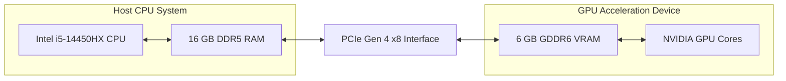

<p align="center">
  
</p>

# Analisis Kinerja Komputasi Heterogen pada General Matrix Multiplication (GEMM): Studi Perbandingan CPU dan GPU

Ujian Akhir Semester Genap Tahun Akademik 2025/2026 | **Arsitektur dan Sistem Komputer**  
**Program Studi S1 Kecerdasan Artifisial (Kelas 2025B)**, Fakultas Matematika dan Ilmu Pengetahuan Alam, **Universitas Negeri Surabaya**

---

<p align="center">
  
  
  
  
  
  
</p>

---

## 👥 Kelompok Penyusun

* **Raffi Khairan Hidayat** (NIM: `25032014040`)
* **Muhammad Panji Asmoro Bangun** (NIM: `25032014088`)
* **Ridho Aryo Ramadhan** (NIM: `25032014069`)

**Program Studi S1 Kecerdasan Artifisial (Kelas 2025B)**  
Fakultas Matematika dan Ilmu Pengetahuan Alam, **Universitas Negeri Surabaya**  
**Dosen Pengampu:** Dr. Widi Aribowo, S.T., M.T. & Harmon Prayogi, M.Sc.  
*Slogan Universitas: "Growing with character"*  

---

## 🎥 Video Demonstrasi Proyek

Tautan publikasi video presentasi dan demonstrasi eksekusi program benchmark komputasi heterogen (durasi 10–15 menit):

* 📺 **Tautan YouTube:** [Tautan Video Presentasi Kelompok](https://youtu.be/ID_VIDEO_ANDA) *(Tautan akan diisi oleh tim setelah sesi perekaman demonstrasi).*

---

## 📌 Deskripsi Proyek

Proyek riset mandiri ini mengimplementasikan perkalian matriks tingkat tinggi (**GEMM - General Matrix Multiplication**) menggunakan arsitektur komputasi heterogen. Secara matematis, perkalian matriks untuk elemen $C_{i,j}$ dari matriks hasil $C = A \times B$ dengan ukuran $N \times N$ didefinisikan sebagai:

$$C_{i,j} = \sum_{k=0}^{N-1} A_{i,k} \times B_{k,j}$$

Kami membandingkan tiga pendekatan utama untuk menganalisis efisiensi, throughput komputasi (*compute throughput*), dan batasan perangkat keras (*hardware bottleneck*):

1. **Sequential CPU (Baseline):** Algoritma perkalian matriks standar *row-major* dengan loop bersarang tiga tingkat (*triple nested loop*) yang dieksekusi pada satu *core* CPU tunggal (*single-thread*) untuk menetapkan dasar keakuratan matematika (*ground truth*).
2. **Parallel CPU (OpenMP):** Paralelisasi *multi-threaded* dengan pembagian kerja multi-dimensi (`collapse(2)`) dan pemetaan beban kerja statis (`schedule(static)`) yang diikat (*pinned*) secara eksplisit pada *Performance Cores* (P-Cores) fisik CPU untuk meminimalkan *thread migration overhead*.
3. **Akselerasi GPU (OpenCL):** Pemrosesan paralel berskala masif memanfaatkan arsitektur GPU NVIDIA Laptop RTX 4050 dengan optimasi *Matrix Tiling* pada memori lokal (`__local` *scratchpad cache*) guna meminimalkan latensi akses memori global (*global memory access latency*).

### 📐 Aliran Data Arsitektur Sistem (Data Flow)



---

## 🚀 Fitur Utama Sistem

* **Optimasi Matrix Tiling:** Desain kernel OpenCL yang membagi matriks berdimensi besar menjadi *tile* kecil berukuran $16 \times 16$ untuk memaksimalkan *spatial & temporal locality* pada *L1/L2 cache* GPU.
* **Protokol Validasi Epsilon ($\varepsilon = 10^{-4}$):** Algoritma pencocokan presisi tingkat tinggi berbasis akumulasi rata-rata selisih absolut untuk mengatasi perbedaan numerik *floating-point* yang muncul akibat eksekusi instruksi *Fused Multiply-Add* (FMA) pada arsitektur GPU.
* **Pengukuran Pipeline GPU Terinci:** Mengisolasi waktu transfer data *Host-to-Device* (H2D), waktu eksekusi kernel murni pada perangkat keras GPU, dan transfer *Device-to-Host* (D2H) guna mendeteksi hambatan latensi pada bus interkoneksi (*PCIe bus bottleneck latency*).
* **Otomatisasi Penuh:** Skrip penganalisis otomatis (`scripts/benchmark.sh` & `scripts/generate_graphs.py`) untuk mengeksekusi matriks pengujian $N \in \{256, 512, 1024, 2048\}$ dengan visualisasi grafik analisis performa berbasis tema gelap (*dark theme*).

---

## 💻 Konfigurasi Sistem Pengujian

* **Processor (CPU):** Intel® Core™ i5-14450HX
  * Arsitektur Hybrid: 6 Performance Cores (P-Cores) & 4 Efficient Cores (E-Cores)
  * Pemrosesan Paralel: 16 Threads, Hyper-Threading Enabled, 20 MB Intel® Smart Cache
  * Frekuensi Turbo Maksimum: 4.80 GHz
* **Graphics Card (GPU):** NVIDIA® GeForce RTX™ 4050 Laptop GPU
  * Arsitektur: Ada Lovelace (6 GB GDDR6 Dedicated VRAM)
  * Spesifikasi Compute: 2560 CUDA Cores, Dukungan FMA (Fused Multiply-Add), & Tensor Cores
  * Daya Kerja Maksimum (TGP): Up to 96W
* **Memory & Interconnect:**
  * RAM Sistem: 16 GB DDR5 Dual-Channel @ 4800 MHz
  * Jalur Komunikasi: PCIe Gen 4 x8 Lane (CPU ↔ GPU Communication)
* **Sistem Operasi:** Arch Linux x86_64 (Kernel Linux 6.x Mainline)
* **Toolchain & Compiler:** GCC 14.1.1 (C11 Standard)
* **API Akselerasi CPU:** OpenMP 4.5 (Multi-threaded Parallelism)
* **API Akselerasi GPU:** OpenCL 1.2 (NVIDIA OpenCL ICD Platform)

---

## 📊 Hasil Pengujian Sistem (Rata-rata 3x Running)

Berikut adalah data hasil pengujian riil yang tercatat pada sistem kami:

| Metode Eksekusi | N = 256 | N = 512 | N = 1024 | N = 2048 | Validitas Numerik |
| :--- | :---: | :---: | :---: | :---: | :---: |
| **Sequential (CPU Baseline)** | 0.0086 s | 0.0654 s | 2.4354 s | 22.5848 s | *Reference* |
| **OpenMP (6 Threads P-Core)** | 0.0030 s | 0.0132 s | 0.4045 s | 3.1620 s | ✅ **VALID** |
| **OpenCL (GPU Tiled)** | 0.0948 s | 0.0870 s | 0.1024 s | 0.1547 s | ✅ **VALID** |

> 💡 **Analisis Ringkas Hasil Eksperimen:**
> * **Efek Latency PCIe (N=256):** Pada matriks kecil, GPU OpenCL justru lebih lambat dibanding CPU karena *overhead* waktu transfer data dari Host ke Device (H2D) lebih mahal ketimbang waktu komputasinya.
> * **Titik Crossover (N=512):** Fase transisi di mana beban komputasi mulai seimbang dengan biaya transfer data memori.
> * **GPU Dominance & Speedup (N=2048):** Pada data masif, arsitektur *parallel throughput* GPU RTX 4050 berhasil mengungguli CPU sekuensial hingga **~146 kali lebih cepat** berkat taktik *Matrix Tiling* dan optimalisasi memori lokal.
> * **Roofline Model Compliance:** Hasil ini mengindikasikan bahwa performa sistem heterogen sangat dipengaruhi oleh rasio antara *compute intensity* dan *memory transfer overhead*, sesuai dengan prinsip dasar *Roofline Model*.

### 📈 Grafik Kinerja (Dark Clean Elegant Theme)

#### 1. Perbandingan Waktu Eksekusi (Lower is Better)


#### 2. Faktor Peningkatan Kinerja / Speedup (Higher is Better)


#### 3. Ringkasan Kinerja Gabungan (Log Scale)


---

## 🛠️ Langkah-Langkah Menjalankan Sistem

### 📦 Prasyarat Instalasi

#### 1. Lingkungan Linux (Arch/Debian/Ubuntu)
Pastikan perkakas kompilasi dan pustaka berikut telah terinstal pada sistem Anda:
```bash
# Untuk Arch Linux
sudo pacman -S base-devel opencl-headers opencl-nvidia python-matplotlib python-numpy

# Untuk Debian/Ubuntu
sudo apt-get install build-essential opencl-headers intel-opencl-icd nvidia-opencl-icd python3-matplotlib python3-numpy
```

#### 2. Lingkungan Windows
Kode program ini telah dioptimasi untuk dapat berjalan di sistem operasi Windows melalui tiga metode alternatif:
* **Metode WSL2 (Sangat Direkomendasikan):** Jalankan eksekusi program di dalam kontainer Windows Subsystem for Linux (WSL2) dengan mengikuti prosedur instalasi Linux Debian/Ubuntu di atas. Pustaka OpenCL akan otomatis terhubung ke kartu grafis host Windows.
* **Metode Native Windows (MSYS2 / MinGW-w64):**
  1. Unduh dan pasang [MSYS2](https://www.msys2.org/).
  2. Buka terminal MSYS2 UCRT64 dan jalankan perintah instalasi perkakas kompilasi:
     ```bash
     pacman -S mingw-w64-ucrt-x86_64-gcc mingw-w64-ucrt-x86_64-make mingw-w64-ucrt-x86_64-opencl
     ```
  3. Lakukan kompilasi menggunakan perintah `mingw32-make build`.
* **Metode Microsoft Visual Studio (MSVC Compiler):**
  1. Buat proyek C++ konsol baru (*Empty Project*) pada IDE Visual Studio Anda.
  2. Masukkan seluruh file sumber dari direktori `src/` (termasuk subfolder `opencl/`) ke dalam hierarki proyek.
  3. Aktifkan dukungan pemrosesan paralel OpenMP melalui menu properties proyek: `Configuration Properties -> C/C++ -> Language -> OpenMP Support -> Yes`.
  4. Unduh SDK OpenCL (biasanya dibundel bersama instalasi NVIDIA CUDA Toolkit) dan hubungkan *link library* `OpenCL.lib` di bagian *linker dependencies* Visual Studio.

---

### 1. Build Kode Sumber
Lakukan kompilasi program untuk membuat executable target `gemm_runner`:
```bash
make build
```

### 2. Jalankan Pengujian Otomatis
Jalankan benchmark otomatis untuk seluruh matriks pengujian:
```bash
make benchmark
```
*Hasil waktu eksekusi mentah akan terekspor secara otomatis ke `test/execution_time.csv`.*

### 3. Hasilkan Grafik Visualisasi
Jalankan visualizer untuk menghasilkan grafik analisis performa:
```bash
make graphs
```
*Grafik output beresolusi tinggi akan tersimpan di dalam folder `test/graphs/`.*

### 4. Eksekusi Seluruh Alur Kerja (All-in-One)
Untuk mengompilasi, menjalankan benchmark, dan menghasilkan grafik sekaligus:
```bash
make all
```

### 5. Membersihkan Proyek
Untuk menghapus file biner hasil kompilasi dan reset file benchmark:
```bash
make clean
```

> 📌 **Catatan Hardware-Aware untuk Eksekusi Manual (OpenMP):**
> Jika Anda ingin menjalankan biner secara manual tanpa skrip otomatisasi, pastikan untuk mengunci *thread* hanya pada P-Core untuk menghindari degradasi performa akibat E-Core:
> ```bash
> OMP_NUM_THREADS=6 OMP_PLACES=cores OMP_PROC_BIND=close ./gemm_runner --mode omp --size 2048
> ```

---

## 📂 Struktur Folder Proyek

```
heterogeneous-gemm/
├── Makefile                 # Otomatisasi kompilasi & pengujian
├── README.md                # Dokumentasi utama proyek UAS
├── src/                     # Seluruh kode sumber C & OpenCL kernel
│   ├── main.c               # Driver benchmark utama
│   ├── gemm_common.h        # Alokasi memori & validasi epsilon
│   ├── sequential.c         # Fungsi perkalian sequential CPU
│   ├── openmp.c             # Paralelisasi multi-core OpenMP
│   └── opencl/
│       ├── opencl_host.c    # Pipeline Host GPU OpenCL
│       └── gemm_kernel.cl   # Kernel GPU Tiling
├── scripts/                 # Otomatisasi penganalisis data
│   ├── benchmark.sh         # Pengumpul metrik dalam bentuk CSV
│   └── generate_graphs.py   # Skrip visualisasi performa
├── test/                    # Folder keluaran pengujian sistem [Wajib UAS]
│   ├── execution_time.csv   # Data metrik aktual
│   └── graphs/              # Grafik visualisasi performa
└── docs/                    # Berkas laporan ilmiah & diagram alir
    ├── analysis.md          # Laporan pembahasan komprehensif
    └── diagrams/
        └── system_flowchart.txt # Alur logika benchmark (ASCII Diagram)
```

---

## ⚠️ Batasan Sistem & Pengembangan Lanjut

Meskipun sistem benchmark ini memberikan analisis performa heterogen yang komprehensif, terdapat beberapa keterbatasan teknis yang dapat dikembangkan lebih lanjut:
1. **Penjadwalan Blok Dinamis (Block Size Auto-Tuning):** Ukuran *tiling* OpenCL saat ini dikunci secara statis pada dimensi $16 \times 16$. Implementasi tingkat lanjut dapat memanfaatkan mekanisme pencarian adaptif untuk menguji Work-Group Size terbaik berdasarkan karakteristik hardware runtime.
2. **Ketiadaan API Proprietary (CUDA):** Pengujian GPU hanya didasarkan pada pustaka open-source cross-platform OpenCL 1.2, belum dibandingkan secara langsung dengan platform native NVIDIA CUDA Core atau CUBLAS teroptimasi.
3. **Optimasi Vektor CPU (Explicit SIMD):** Bagian paralelisasi CPU saat ini sepenuhnya mengandalkan optimasi compiler otomatis dan pragma OpenMP, tanpa pemanfaatan instruksi intrinsik instruksi vektor perangkat keras secara eksplisit (seperti AVX2/AVX-512).

---

## 📜 Integritas Akademik & Lisensi

Proyek ini disusun sepenuhnya sebagai syarat pemenuhan Ujian Akhir Semester untuk mata kuliah Arsitektur dan Sistem Komputer di Universitas Negeri Surabaya. Seluruh data benchmark yang disajikan bersifat riil dan diambil langsung dari perangkat keras yang tertera pada spesifikasi. Kode sumber dilisensikan di bawah [MIT License](LICENSE).

---

> www.unesa.ac.id | **"Growing with character"**
