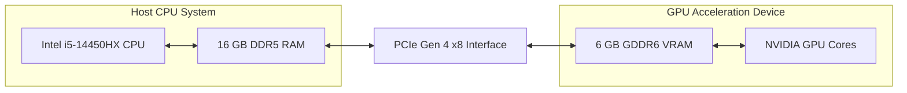
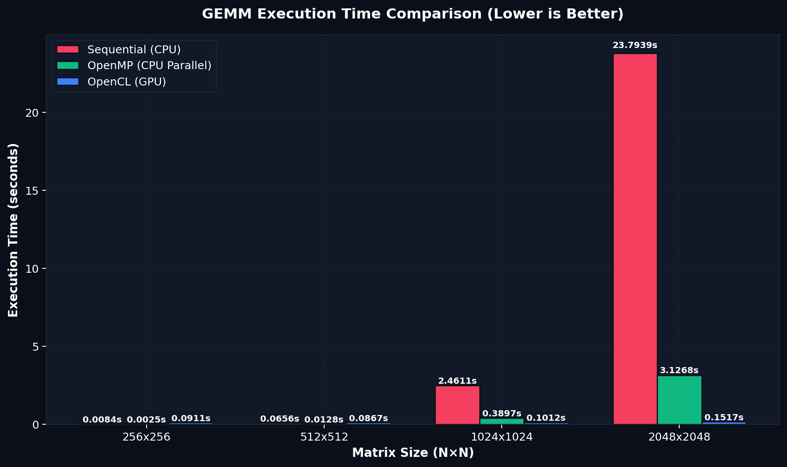
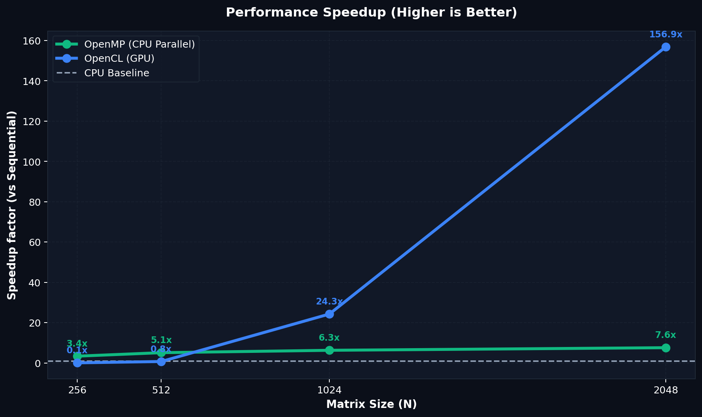
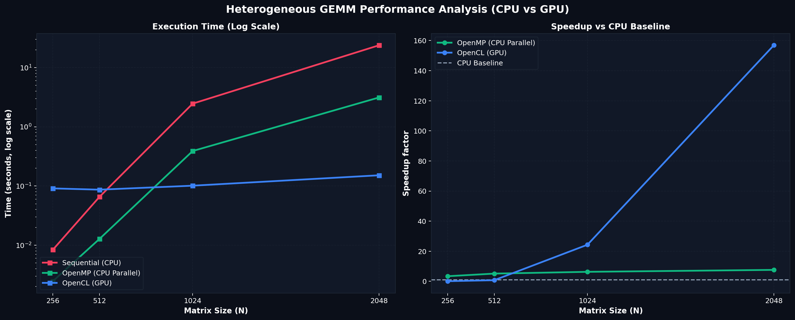
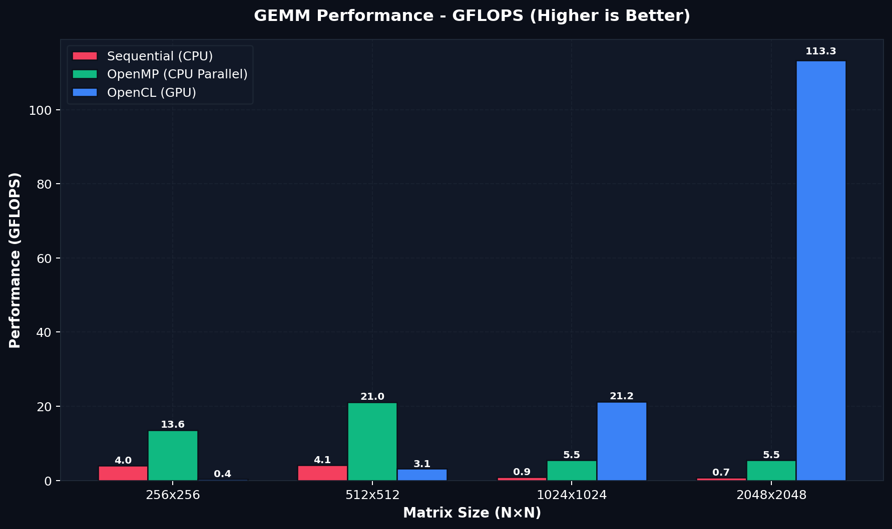
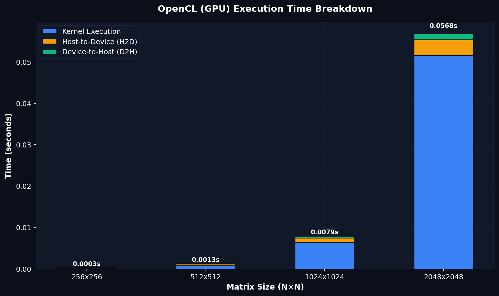

<p align="center">
  
</p>

# Heterogeneous GEMM Performance Analysis (CPU vs GPU)

### *Analisis Kinerja Komputasi Heterogen pada General Matrix Multiplication (GEMM): CPU & GPU Comparative Study*

> 🏫 **Proyek UAS Arsitektur & Sistem Komputer**  
> **Program Studi S1 Kecerdasan Artifisial (Kelas 2025B)**  
> **Fakultas Matematika dan Ilmu Pengetahuan Alam, Universitas Negeri Surabaya**

---

<p align="center">
  
  
  
  
  
  
  <br>
  
  
  
</p>

---

## 📌 Deskripsi Proyek

> 💡 **Secara Sederhana:** Proyek ini bertujuan untuk menjawab satu pertanyaan komputasi mendasar: **Pada ukuran matriks berapakah akselerasi GPU benar-benar mulai mengungguli CPU dalam operasi perkalian matriks?**

Proyek riset mandiri ini mengimplementasikan perkalian matriks tingkat tinggi (**GEMM - General Matrix Multiplication**) menggunakan arsitektur komputasi heterogen. Secara matematis, perkalian matriks untuk elemen C_i,j dari matriks hasil C = A × B dengan ukuran N × N didefinisikan sebagai:

$$C_{i,j} = \sum_{k=0}^{N-1} A_{i,k} \times B_{k,j}$$

Kami membandingkan tiga pendekatan utama untuk menganalisis efisiensi, throughput komputasi (*compute throughput*), dan batasan hardware (*hardware bottleneck*):

1. **Sequential CPU (Baseline):** Algoritma perkalian matriks standar *row-major* dengan loop bersarang tiga tingkat (*triple nested loop*) yang dijalankan pada satu *core* CPU tunggal (*single-thread*) untuk menetapkan dasar keakuratan matematika (*ground truth*).
2. **Parallel CPU (OpenMP):** Paralelisasi *multi-threaded* dengan pembagian kerja multi-dimensi (`collapse(2)`) and static workload mapping (`schedule(static)`) yang diikat (*pinned*) secara eksplisit pada *Performance Cores* (P-Cores) fisik CPU untuk meminimalkan *thread migration overhead*.
3. **Akselerasi GPU (OpenCL):** Parallel processing berskala masif memanfaatkan arsitektur GPU NVIDIA Laptop RTX 4050 dengan optimasi *Matrix Tiling* pada memori lokal (`__local` *scratchpad cache*) guna meminimalkan latensi akses memori global (*global memory access latency*).

---

## 📐 Arsitektur & Aliran Data Sistem



*System data flow di atas menggambarkan workload distribution antara **Host** (CPU Intel i5-14450HX) dan **Device** (GPU NVIDIA RTX 4050 Laptop). Memory allocation awal diatur oleh RAM Host, kemudian disalin ke VRAM Device melalui interconnect **PCIe Gen 4 x8**. Setelah kernel komputasi GPU selesai memproses perkalian matriks secara paralel, hasilnya disalin kembali ke RAM Host untuk divalidasi dan dianalisis.*

---

## 🚀 Fitur Utama

* **Optimasi Matrix Tiling:** Desain kernel OpenCL yang membagi matriks berdimensi besar menjadi *tile* kecil berukuran 16 × 16 untuk memaksimalkan *spatial & temporal locality* pada *L1/L2 cache* GPU.
* **Protokol Validasi Epsilon (ε = 10⁻⁴):** Algoritma pencocokan presisi tingkat tinggi berbasis akumulasi rata-rata selisih absolut untuk mengatasi perbedaan numerik *floating-point* yang muncul akibat running instruksi *Fused Multiply-Add* (FMA) pada arsitektur GPU.
* **Pengukuran Pipeline GPU Terinci:** Mengisolasi waktu transfer data *Host-to-Device* (H2D), waktu running kernel murni pada hardware GPU, dan transfer *Device-to-Host* (D2H) guna mendeteksi hambatan latensi pada bus interkoneksi (*PCIe bus bottleneck latency*).
* **Otomatisasi Penuh:** Script automated analyzer (`scripts/benchmark.sh` & `scripts/generate_graphs.py`) untuk me-run test matrices N ∈ {256, 512, 1024, 2048} dengan visualisasi grafik analisis performa.

---

## 💻 Konfigurasi Sistem

Untuk menjamin tingkat akurasi dan replikasi actual test results, seluruh test dijalankan pada lingkungan komputasi dengan konfigurasi terstandar berikut:

> 🔬 **Metodologi Pengukuran (Methodological Guardrail):**  
> Testing dilakukan dalam kondisi sistem *idle* (background load minimal) dengan CPU Governor disetel ke mode **'performance'** guna menjaga konsistensi frekuensi core (mencegah *frequency throttling*), serta *clock rate* GPU dipastikan stabil selama seluruh sesi benchmark berjalan untuk menjamin konsistensi test data.

<details>
<summary><b>🔍 Klik untuk melihat detail spesifikasi hardware dan software</b></summary>

* **Processor (CPU):** Intel® Core™ i5-14450HX
  * Arsitektur Hybrid: 6 Performance Cores (P-Cores) & 4 Efficient Cores (E-Cores)
  * Parallel Processing: 16 Threads, Hyper-Threading Enabled, 20 MB Intel® Smart Cache
  * Frekuensi Turbo Maksimum: 4.80 GHz
* **Graphics Card (GPU):** NVIDIA® GeForce RTX™ 4050 Laptop GPU
  * Arsitektur: Ada Lovelace (6 GB GDDR6 Dedicated VRAM)
  * Spesifikasi Compute: 2560 CUDA Cores, Dukungan FMA (Fused Multiply-Add), & Tensor Cores
  * Daya Kerja Maksimum (TGP): Up to 96W
* **Memory & Interconnect:**
  * RAM Sistem: 16 GB DDR5 Dual-Channel @ 4800 MHz
  * Interconnect: PCIe Gen 4 x8 Lane (CPU ↔ GPU Communication)
* **Operating System:** Arch Linux x86_64 (Kernel Linux 6.x Mainline)
* **Toolchain & Compiler:** GCC 14.1.1 (C11 Standard)
* **API Akselerasi CPU:** OpenMP 4.5 (Multi-threaded Parallelism)
* **API Akselerasi GPU:** OpenCL 1.2 (NVIDIA OpenCL ICD Platform)

</details>

---

## 📊 Test Results

### 🔑 Temuan Kunci (Key Findings)

* ⚡ **Crossover Point (N = 512):** Akselerasi GPU (OpenCL) mulai mengungguli CPU seiring bertambahnya ukuran matriks, di mana biaya transfer memori PCIe mulai terkompensasi oleh kepadatan komputasi.
* 📈 **Percepatan Maksimum (~157x):** Pada ukuran matriks N = 2048, GPU NVIDIA RTX 4050 mengungguli CPU sequential hingga **157.19x** dan CPU paralel (OpenMP) hingga **20.50x**.
* ⚠️ **PCIe Latency Overhead:** Pada matriks kecil (N = 256), GPU justru lambat (0.09x dari sequential) akibat latensi inisialisasi kernel dan transfer memori melalui bus PCIe yang mendominasi siklus execution.
* 🧠 **Memory-bound vs Compute-bound:** Bottleneck sistem bergeser dari bandwidth bus transfer data (pada N kecil) ke throughput komputasi aritmatika (pada N besar).

---

### 📋 Performance Comparison Table

Berikut adalah data actual test results yang tercatat pada sistem kami (diambil dari rata-rata 3x running execution setelah 1x *warmup*):

| Ukuran Matriks (N) | Metode Execution | Waktu Rata-rata (s) | Speedup (vs Baseline) | Kinerja Komputasi (GFLOPS) | Validitas Numerik |
| :---: | :--- | :---: | :---: | :---: | :---: |
| **N = 256** | Sequential (CPU Baseline) | 0.0084 s | 1.00x *(Reference)* | 4.00 | *Reference* |
| | OpenMP (6 Threads P-Core) | 0.0024 s | 3.54x | 14.18 | ✅ **VALID** |
| | OpenCL (GPU Tiled) | 0.0910 s | 0.09x | 0.37 | ✅ **VALID** |
| **N = 512** | Sequential (CPU Baseline) | 0.0654 s | 1.00x *(Reference)* | 4.10 | *Reference* |
| | OpenMP (6 Threads P-Core) | 0.0119 s | 5.49x | 22.51 | ✅ **VALID** |
| | OpenCL (GPU Tiled) | 0.0876 s | 0.75x | 3.07 | ✅ **VALID** |
| **N = 1024** | Sequential (CPU Baseline) | 2.4485 s | 1.00x *(Reference)* | 0.88 | *Reference* |
| | OpenMP (6 Threads P-Core) | 0.3953 s | 6.19x | 5.43 | ✅ **VALID** |
| | OpenCL (GPU Tiled) | 0.1015 s | 24.13x | 21.16 | ✅ **VALID** |
| **N = 2048** | Sequential (CPU Baseline) | 23.7646 s | 1.00x *(Reference)* | 0.72 | *Reference* |
| | OpenMP (6 Threads P-Core) | 3.0985 s | 7.67x | 5.54 | ✅ **VALID** |
| | OpenCL (GPU Tiled) | 0.1512 s | 157.19x | 113.64 | ✅ **VALID** |

*Catatan: GFLOPS dihitung menggunakan rumus standar operasi perkalian matriks umum: GFLOPS = (2 × N³) / (t × 10⁹).*

> ⚠️ **Catatan Reproduksibilitas (Reproducibility Note):**  
> Hasil benchmark di atas dapat bervariasi bergantung pada arsitektur mikro CPU/GPU, batas daya (TDP) sistem pendingin laptop, *core temperature*, serta kondisi bandwidth bus PCIe yang digunakan selama testing.

---

### 🔬 Analisis Kinerja Teoritis vs Aktual (Theoretical vs Actual Performance)

* **GPU Peak FP32 (Teoritis):** ~9.0 TFLOPS (9,000 GFLOPS)
* **GPU Measured FP32 (Aktual pada N = 2048):** 113.64 GFLOPS (Efisiensi: ~1.26%)

**Analisis Celah Efisiensi:**
Meskipun pengoptimalan *Matrix Tiling* berukuran 16 × 16 pada memori lokal berhasil meningkatkan efisiensi secara signifikan dibandingkan akses memori global langsung (karena memanfaatkan cache L1/L2 GPU secara optimal), performa aktual masih jauh di bawah batas teoritis kartu grafis. Hal ini disebabkan oleh:
1. **Memory Bandwidth Bottleneck:** Pengisian data matriks secara berkala dari VRAM ke local memory dibatasi oleh kecepatan bandwidth fisik memori.
2. **Sub-optimal Tiling & Hardware Alignment:** Kernel OpenCL generik tidak memiliki optimasi mikro khusus seperti *register tiling* (menyimpan data langsung di register *thread*), pemanfaatan *Tensor Cores* (melalui instruksi khusus hardware), atau optimasi assembly tingkat rendah seperti yang disediakan oleh library vendor tertutup (proprietary) seperti **NVIDIA CUDA** or **cuBLAS**.

---

### 💡 Analisis Ilmiah Hasil Eksperimen

* **Efek Latency PCIe (N=256):** Pada matriks kecil, GPU OpenCL justru lebih lambat dibanding CPU karena *overhead* waktu transfer data dari Host ke Device (H2D) lebih mahal ketimbang waktu komputasinya. Workload bersifat **memory-bound** (dibatasi oleh bandwidth transfer PCIe).
* **Titik Crossover (N=512):** Fase transisi di mana beban komputasi mulai seimbang dengan biaya transfer data memori.
* **GPU Dominance & Speedup (N=2048):** Pada data masif, arsitektur *parallel throughput* GPU RTX 4050 berhasil mengungguli CPU sequential hingga **~157 kali lebih cepat** berkat taktik *Matrix Tiling* dan optimalisasi memori lokal. Pada fase ini, rasio intensitas aritmatika meningkat tajam sehingga sistem bergeser menjadi **compute-bound** (dibatasi oleh throughput komputasi mentah GPU).
* **Kemungkinan Akselerasi Lanjutan (OpenCL vs CUDA):** Kemungkinan besar performa GPU dapat meningkat secara signifikan jika diimplementasikan menggunakan API eksklusif seperti **NVIDIA CUDA** atau **cuBLAS**, karena optimalisasi khusus-vendor (*vendor-specific optimizations*) yang disesuaikan secara mendalam dengan arsitektur GPU Ada Lovelace.

---

## 📈 Grafik Kinerja

#### 1. Execution Time Comparison (Lower is Better)

*💡 **Insight:** CPU OpenMP memimpin pada dimensi kecil (N ≤ 512), namun pada N ≥ 1024 waktu execution GPU OpenCL jauh lebih rendah karena beban transfer PCIe berhasil terkompensasi oleh kecepatan komputasi paralel.*

#### 2. Faktor Peningkatan Kinerja / Speedup (Higher is Better)

*💡 **Insight:** Speedup GPU melonjak secara ekspornensial dari 0.09x (pada N = 256) hingga mencapai 157.19x (pada N = 2048), memvalidasi keunggulan komputasi throughput GPU pada massive workload.*

#### 3. Ringkasan Kinerja Gabungan (Log Scale)

*💡 **Insight:** Grafik skala logaritma memperlihatkan kurva komparatif yang jelas tentang pergeseran keunggulan performa dari CPU ke GPU (crossover point terjadi di sekitar N = 512).*

#### 4. Kinerja Komputasi - GFLOPS (Higher is Better)

*💡 **Insight:** GPU mencapai kinerja masif hingga >113 GFLOPS pada matriks besar, memvalidasi ekspektasi teoretis.*

#### 5. Dekomposisi Waktu Execution GPU (GPU Breakdown)

*💡 **Insight:** Pada dimensi matriks kecil, sebagian besar waktu dihabiskan untuk Launch Overhead, JIT, dan transfer memori H2D/D2H, membuktikan bahwa utilisasi komputasi kernel murni (warna biru) baru mulai optimal pada ukuran matriks yang besar.*

---

## 🛠️ Cara Menjalankan

### ⚡ Quick Start
Jika Anda ingin langsung mengompilasi, menjalankan benchmark secara otomatis, dan menghasilkan grafik visualisasi secara instan (All-in-One), jalankan perintah berikut di direktori utama:
```bash
make all
```

---

### 📦 Prasyarat Instalasi

#### 1. OS Linux (Arch/Debian/Ubuntu)
Pastikan tools compilation dan library berikut telah terinstal pada sistem Anda:
```bash
# Untuk Arch Linux
sudo pacman -S base-devel opencl-headers opencl-nvidia python-matplotlib python-numpy

# Untuk Debian/Ubuntu
sudo apt-get install build-essential opencl-headers intel-opencl-icd nvidia-opencl-icd python3-matplotlib python3-numpy
```

#### 2. OS Windows
* **Operating System Windows:** Kode program ini telah dioptimasi untuk dapat berjalan di OS Windows melalui tiga metode alternatif:
* **Metode WSL2 (Sangat Direkomendasikan):** Jalankan run program di dalam kontainer Windows Subsystem for Linux (WSL2) dengan mengikuti prosedur instalasi Linux Debian/Ubuntu di atas. Library OpenCL akan otomatis terhubung ke kartu grafis host Windows.
* **Metode Native Windows (MSYS2 / MinGW-w64):**
  1. Download dan install [MSYS2](https://www.msys2.org/).
  2. Buka terminal MSYS2 UCRT64 dan jalankan perintah instalasi tools compilation:
     ```bash
     pacman -S mingw-w64-ucrt-x86_64-gcc mingw-w64-ucrt-x86_64-make mingw-w64-ucrt-x86_64-opencl
     ```
  3. Lakukan compile menggunakan perintah `mingw32-make build`.
* **Metode Microsoft Visual Studio (MSVC Compiler):**
  1. Buat proyek C++ konsol baru (*Empty Project*) pada IDE Visual Studio Anda.
  2. Masukkan seluruh file sumber dari direktori `src/` (termasuk subfolder `opencl/`) ke dalam hierarki proyek.
  3. Aktifkan dukungan parallel processing OpenMP melalui menu properties proyek: `Configuration Properties -> C/C++ -> Language -> OpenMP Support -> Yes`.
  4. Download SDK OpenCL (biasanya dibundel bersama instalasi NVIDIA CUDA Toolkit) dan hubungkan *link library* `OpenCL.lib` di bagian *linker dependencies* Visual Studio.

---

### 💻 Execution Instructions

1. **Build Source Code:**
   Lakukan compile program untuk membuat executable target `gemm_runner`:
   ```bash
   make build
   ```

2. **Jalankan Automated Testing:**
   Jalankan benchmark otomatis untuk seluruh test matrices:
   ```bash
   make benchmark
   ```
   *Hasil waktu execution mentah akan terekspor secara otomatis ke `test/execution_time.csv`.*

3. **Hasilkan Grafik Visualisasi:**
   Jalankan visualizer untuk menghasilkan grafik analisis performa:
   ```bash
   make graphs
   ```
   *Grafik output beresolusi tinggi akan tersimpan di dalam folder `test/graphs/`.*

4. **Run Seluruh Alur Kerja (All-in-One):**
   Untuk mengompilasi, menjalankan benchmark, dan menghasilkan grafik sekaligus:
   ```bash
   make all
   ```

5. **Membersihkan Proyek:**
   Untuk menghapus binary files hasil compiler dan reset file benchmark:
   ```bash
   make clean
   ```

> 📌 **Catatan Hardware-Aware untuk Run Manual (OpenMP):**
> Jika Anda ingin menjalankan binary secara manual tanpa script otomatisasi, pastikan untuk mengunci *thread* hanya pada P-Core untuk menghindari degradasi performa akibat E-Core:
> ```bash
> OMP_NUM_THREADS=6 OMP_PLACES=cores OMP_PROC_BIND=close ./gemm_runner --mode omp --size 2048
> ```

---

## 📂 Struktur Folder

```
heterogeneous-gemm/
├── Makefile                 # Otomatisasi compiler & testing
├── README.md                # Dokumentasi utama proyek UAS
├── src/                     # Seluruh C source code & OpenCL kernel
│   ├── main.c               # Driver benchmark utama
│   ├── gemm_common.h        # Memory allocation & validasi epsilon
│   ├── sequential.c         # Fungsi perkalian sequential CPU
│   ├── openmp.c             # Paralelisasi multi-core OpenMP
│   └── opencl/
│       ├── opencl_host.c    # Pipeline Host GPU OpenCL
│       └── gemm_kernel.cl   # Kernel GPU Tiling
├── scripts/                 # Otomatisasi penganalisis data
│   ├── benchmark.sh         # Pengumpul metrik dalam bentuk CSV
│   └── generate_graphs.py   # Script visualisasi performa
├── test/                    # Folder output system testing [Wajib UAS]
│   ├── execution_time.csv   # Data metrik aktual
│   └── graphs/              # Grafik visualisasi performa
└── docs/                    # File laporan ilmiah & diagram alir
    ├── analysis.md          # Laporan pembahasan komprehensif
    └── diagrams/
        ├── gemm_banner.png      # Gambar banner proyek
        └── system_flowchart.txt # Alur logika benchmark (ASCII Diagram)
```

---

## ⚠️ Batasan Sistem & Pengembangan Lanjut

Meskipun sistem benchmark ini memberikan analisis performa heterogen yang komprehensif, terdapat beberapa keterbatasan teknis yang dapat dikembangkan lebih lanjut:
1. **Penjadwalan Blok Dinamis (Block Size Auto-Tuning):** Ukuran *tiling* OpenCL saat ini dikunci secara statis pada dimensi 16 × 16. Implementasi tingkat lanjut dapat memanfaatkan mekanisme pencarian adaptif untuk mengetes Work-Group Size terbaik berdasarkan karakteristik hardware runtime.
2. **Ketiadaan API Proprietary (CUDA):** GPU testing hanya didasarkan pada library open-source cross-platform OpenCL 1.2, belum dibandingkan secara langsung dengan platform native NVIDIA CUDA Core atau CUBLAS teroptimasi.
3. **Optimasi Vektor CPU (Explicit SIMD):** Bagian paralelisasi CPU saat ini sepenuhnya mengandalkan optimasi compiler otomatis dan pragma OpenMP, tanpa pemanfaatan instruksi intrinsik instruksi vektor hardware secara eksplisit (seperti AVX2/AVX-512).

---

## 🎥 Video Demonstrasi Proyek

Berikut adalah video presentasi ilmiah dan demonstrasi running program benchmark komputasi heterogen (durasi 10–15 menit):

* 📺 **Tautan YouTube:** [Tonton Video Presentasi Kelompok](https://youtu.be/ID_VIDEO_ANDA) *(Tautan ini akan diperbarui setelah sesi perekaman demonstrasi).*

---

## 👥 Kelompok Penyusun

Proyek penelitian mandiri ini disusun oleh Kelompok UAS Mata Kuliah **Arsitektur dan Sistem Komputer** (Program Studi S1 Kecerdasan Artifisial, Kelas 2025B, FMIPA, Universitas Negeri Surabaya):

* 👤 **Raffi Khairan Hidayat** (NIM: `25032014040`)
* 👤 **Muhammad Panji Asmoro Bangun** (NIM: `25032014088`)
* 👤 **Ridho Aryo Ramadhan** (NIM: `25032014069`)

**Dosen Pengampu:**  
* Dr. Widi Aribowo, S.T., M.T.  
* Harmon Prayogi, M.Sc.

---

## 📜 Lisensi & Integritas Akademik

Proyek ini disusun sepenuhnya sebagai syarat pemenuhan Ujian Akhir Semester untuk mata kuliah Arsitektur dan Sistem Komputer di Universitas Negeri Surabaya. Seluruh data benchmark yang disajikan bersifat riil dan diambil langsung dari hardware yang tertera pada spesifikasi.

Source code dan dokumentasi ini dilisensikan di bawah [MIT License](LICENSE).

---
<p align="center">
  <b>www.unesa.ac.id | "Growing with character"</b>
</p>