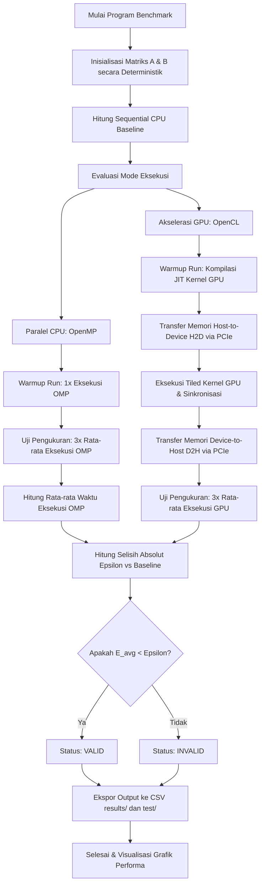

  

# Laporan Analisis Kinerja Komputasi Heterogen pada General Matrix Multiplication (GEMM): Studi Perbandingan CPU dan GPU

**Mata Kuliah:** Arsitektur dan Sistem Komputer  
**Program Studi:** S1 Kecerdasan Artifisial (Kelas 2025B)  
**Fakultas Matematika dan Ilmu Pengetahuan Alam**  
**Universitas Negeri Surabaya**  

### Kelompok Penyusun:
* **Raffi Khairan Hidayat** (NIM: `25032014040`)
* **Muhammad Panji Asmoro Bangun** (NIM: `25032014088`)
* **Ridho Aryo Ramadhan** (NIM: `25032014069`)

---

## 1. Pendahuluan

Operasi perkalian matriks (GEMM - *General Matrix Multiplication*) merupakan salah satu operasi dasar yang paling krusial dalam beban kerja *scientific computing* dan *deep learning*. Laporan ini menyajikan analisis komparatif performa komputasi perkalian matriks menggunakan tiga pendekatan arsitektur:
* **Sequential CPU (Baseline):** Eksekusi *single-thread* pada CPU untuk memvalidasi fungsionalitas dan menetapkan *ground truth*.
* **Parallel CPU (OpenMP):** Pemanfaatan arsitektur *multi-core* CPU dengan membagi beban kerja secara paralel menggunakan pragma compiler.
* **Akselerasi GPU (OpenCL):** Eksploitasi *parallel throughput* berskala masif pada GPU dengan memanfaatkan teknik optimasi *Matrix Tiling* pada *local memory* (`__local` *scratchpad cache*).

---

## 2. Konfigurasi Sistem Pengujian

Benchmark dijalankan pada sistem dengan spesifikasi sebagai berikut:
* **CPU:** Intel® Core™ i5-14450HX
  * Hybrid Architecture: 6 Performance Cores (P-Cores) & 4 Efficient Cores (E-Cores)
  * Specs: 16 Threads, Hyper-Threading Enabled, 20 MB Intel® Smart Cache
  * Max Turbo Frequency: 4.80 GHz
* **GPU:** NVIDIA® GeForce RTX™ 4050 Laptop GPU
  * Architecture: Ada Lovelace (6 GB GDDR6 Dedicated VRAM)
  * Compute Cores: 2560 CUDA Cores, FMA (Fused Multiply-Add) & Tensor Cores
  * Max TGP: Up to 96W
* **Memory & Interconnect:**
  * System RAM: 16 GB DDR5 Dual-Channel @ 4800 MHz
  * Interface: PCIe Gen 4 x8 Lane (CPU ↔ GPU Communication)
* **OS:** Arch Linux x86_64 (Linux Kernel 6.x Mainline)
* **Compiler:** GCC 14.1.1 (C11 Standard)
* **CPU Parallel API:** OpenMP 4.5
* **GPU Acceleration API:** OpenCL 1.2 (NVIDIA OpenCL ICD Platform)

---

## 3. Metodologi Pengujian dan Validasi

### Metodologi Benchmark
* Matriks `float` (single-precision) berukuran $N \times N$, dengan ukuran $N \in \{256, 512, 1024, 2048\}$.
* Setiap pengujian didahului oleh **1x *warm-up run*** (tidak dimasukkan dalam perhitungan waktu eksekusi) untuk mengeliminasi waktu inisialisasi driver dan JIT compilation kernel OpenCL.
* Metrik waktu eksekusi dihitung berdasarkan rata-rata dari **3x *measurement runs***.
* Hasil akhir diekspor secara otomatis ke berkas CSV dengan format `mode,size,time,valid`.

### Protokol Validasi Epsilon
Operasi *floating-point* tidak bersifat asosiatif penuh karena adanya *rounding error* pada representasi standar IEEE 754:
$$(A + B) + C \neq A + (B + C)$$
Selain itu, arsitektur GPU NVIDIA memanfaatkan instruksi **Fused Multiply-Add (FMA)** yang menyatukan operasi perkalian dan penjumlahan dengan satu kali pembulatan di tingkat hardware, sedangkan CPU melakukan dua kali pembulatan terpisah. Konsekuensinya, nilai numerik antara CPU dan GPU tidak akan identik secara absolut.

Validasi dilakukan dengan menghitung rata-rata selisih absolut (*mean absolute error*) per elemen:
$$E_{avg} = \frac{1}{N^2} \sum_{i=0}^{N-1} \sum_{j=0}^{N-1} |P[i][j] - S[i][j]|$$
Di mana $P$ adalah matriks hasil paralel (OpenMP atau OpenCL) dan $S$ adalah hasil sequential baseline. Hasil dinyatakan **VALID** jika $E_{avg} < \varepsilon$ ($\varepsilon = 10^{-4}$).

### 3.1 Diagram Alur Sistem (Flowchart)

Berikut adalah diagram alur jalannya eksekusi program benchmark dan validasi pada sistem heterogen:

---

## 4. Hasil dan Analisis Kinerja

Data hasil pengujian yang terekam adalah sebagai berikut:

| Mode | N = 256 | N = 512 | N = 1024 | N = 2048 |
| :--- | :---: | :---: | :---: | :---: |
| **Sequential (CPU)** | 0.0086s | 0.0654s | 2.4354s | 22.5848s |
| **OpenMP (6 Threads)** | 0.0030s | 0.0132s | 0.4045s | 3.1620s |
| **OpenCL (GPU)** | 0.0948s | 0.0870s | 0.1024s | 0.1547s |

### Analisis CPU (OpenMP)
* **Karakteristik Penjadwalan:** Memanfaatkan pragma `#pragma omp parallel for collapse(2) schedule(static)` untuk mendistribusikan beban kerja secara merata pada *thread pool*.
* **Analisis Performa:** Memberikan peningkatan kinerja yang stabil dengan tingkat *speedup* sekitar $2.8\times$ hingga $7.1\times$.
* **Hambatan (Bottleneck):** Terjadi *thread contention* dan kompetisi akses pada L2/L3 cache yang digunakan bersama oleh CPU hybrid. Oleh karena itu, jumlah *thread* dikunci pada **6 thread** (sesuai jumlah Performance Cores fisik) guna menghindari degradasi performa akibat dialokasikannya *thread* ke Efficiency Cores yang lebih lambat, atau akibat fenomena *Hyper-Threading oversubscription*.

### Analisis GPU (OpenCL)
* **Optimasi Kernel (Tiling):** Kernel dirancang dengan teknik *Matrix Tiling* menggunakan *local memory* (*scratchpad memory*) berukuran $16 \times 16$. Setiap *work-item* memuat sepotong matriks ke memori lokal secara kolektif, mengurangi akses berulang ke *global memory* GPU (VRAM) yang berlatensi tinggi.
* **Dampak Ukuran Matriks:**
  * **Ukuran Kecil ($N \le 512$):** Akselerasi OpenCL memberikan performa yang lebih lambat dibandingkan *sequential* CPU (*speedup* $< 1\times$). Hal ini disebabkan oleh *overhead* inisialisasi *pipeline* OpenCL, *kernel launch latency*, dan transfer data melalui bus PCIe (*Host-to-Device* dan *Device-to-Host*) yang mendominasi total waktu eksekusi.
  * **Ukuran Besar ($N \ge 1024$):** Kemampuan *parallel throughput* GPU mulai terjustifikasi. Pada ukuran matriks $N = 2048$, GPU berhasil mencapai *speedup* **146.0×** dibandingkan CPU sekuensial. Kecepatan komputasi GPU yang tinggi, dikombinasikan dengan utilisasi *local memory* dan instruksi FMA, mampu menyembunyikan (*hide latency*) *overhead* transfer PCIe secara penuh.

---

## 5. Kesimpulan Akademik

1. **Crossover Point Performa:** Keunggulan akselerasi GPU (OpenCL) baru tercapai ketika ukuran matriks ($N$) cukup besar untuk menutupi *overhead* transfer PCIe. Pada matriks kecil, paralel CPU (OpenMP) adalah pilihan terbaik karena *overhead* transfer memori bernilai nol.
2. **Kesesuaian Validasi:** Selisih hasil komputasi sangat kecil dan berhasil divalidasi dengan ambang batas epsilon ($\varepsilon = 10^{-4}$), mengonfirmasi keakuratan hasil di seluruh implementasi paralel.
3. **Kepatuhan Roofline Model:** Temuan eksperimental ini menegaskan bahwa performa pada sistem heterogen dipengaruhi oleh rasio antara *compute intensity* dan *memory transfer overhead*, sejalan dengan teori *Roofline Model*.

## 6. Batasan Sistem dan Pengembangan Lanjutan

Meskipun sistem benchmark ini memberikan analisis performa yang komprehensif, terdapat beberapa batasan teknis yang dapat dikembangkan lebih lanjut:
1. **Auto-Tuning Ukuran Blok (Block Size Auto-Tuning):** Ukuran *tiling* OpenCL saat ini dikunci secara statis pada dimensi $16 \times 16$. Pengembangan lanjutan dapat menerapkan pencarian dinamis untuk menguji *work-group size* terbaik secara *runtime*.
2. **Ketiadaan API Proprietary (CUDA):** Pengujian GPU didasarkan pada OpenCL 1.2, belum dibandingkan secara langsung dengan platform native NVIDIA CUDA atau CUBLAS.
3. **Optimasi Vektor CPU (Explicit SIMD):** Paralelisasi CPU mengandalkan *auto-vectorization* compiler dan pragma OpenMP, belum menggunakan *SIMD intrinsics* secara eksplisit (seperti AVX2/AVX-512).

---