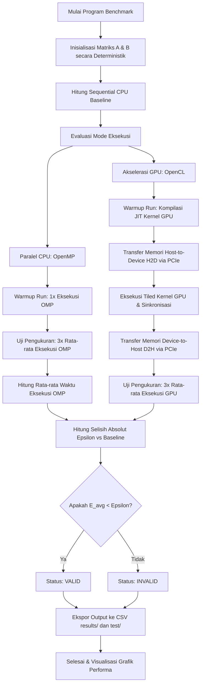

  

# Laporan Analisis Kinerja Komputasi Heterogen pada General Matrix Multiplication (GEMM): Studi Perbandingan CPU dan GPU

**Mata Kuliah:** Arsitektur dan Sistem Komputer  
**Program Studi:** S1 Kecerdasan Artifisial (Kelas 2025B)  
**Fakultas Matematika dan Ilmu Pengetahuan Alam**  
**Universitas Negeri Surabaya**  

### Kelompok Penyusun:
* **Raffi Khairan Hidayat** (NIM: `25032014040`)
* **Muhammad Panji Asmoro Bangun** (NIM: `25032014088`)
* **Ridho Aryo Ramadhan** (NIM: `25032014069`)

---

## 1. Pendahuluan

Operasi perkalian matriks (GEMM - *General Matrix Multiplication*) merupakan salah satu operasi dasar yang paling krusial dalam beban kerja komputasi saintifik (*scientific computing*) dan kecerdasan artifisial (*deep learning*). Laporan ini menyajikan analisis komparatif performa komputasi perkalian matriks menggunakan tiga pendekatan arsitektur komputasi:
* **Sequential CPU (Baseline):** Eksekusi instruksi *single-thread* pada CPU untuk memvalidasi fungsionalitas dan menetapkan dasar akurasi numerik (*ground truth*).
* **Parallel CPU (OpenMP):** Pemanfaatan arsitektur *multi-core* CPU dengan membagi beban kerja secara paralel menggunakan instruksi pragma kompilator (*compiler pragmas*).
* **Akselerasi GPU (OpenCL):** Eksploitasi kapabilitas *parallel throughput* berskala masif pada GPU dengan memanfaatkan teknik optimasi *tiling* pada memori lokal (*scratchpad memory*).

---

## 2. Konfigurasi Sistem Pengujian

Benchmark dijalankan pada sistem dengan spesifikasi perangkat lunak dan perangkat keras sebagai berikut:
* **Processor (CPU):** Intel® Core™ i5-14450HX
  * Arsitektur Hybrid: 6 Performance Cores (P-Cores) & 4 Efficient Cores (E-Cores)
  * Pemrosesan Paralel: 16 Threads, Hyper-Threading Enabled, 20 MB Intel® Smart Cache
  * Frekuensi Turbo Maksimum: 4.80 GHz
* **Graphics Card (GPU):** NVIDIA® GeForce RTX™ 4050 Laptop GPU
  * Arsitektur: Ada Lovelace (6 GB GDDR6 Dedicated VRAM)
  * Spesifikasi Compute: 2560 CUDA Cores, Dukungan FMA (Fused Multiply-Add), & Tensor Cores
  * Daya Kerja Maksimum (TGP): Up to 96W
* **Memory & Interconnect:**
  * RAM Sistem: 16 GB DDR5 Dual-Channel @ 4800 MHz
  * Jalur Komunikasi: PCIe Gen 4 x8 Lane (CPU ↔ GPU Communication)
* **Sistem Operasi:** Arch Linux x86_64 (Kernel Linux 6.x Mainline)
* **Toolchain & Compiler:** GCC 14.1.1 (C11 Standard)
* **API Akselerasi CPU:** OpenMP 4.5 (Multi-threaded Parallelism)
* **API Akselerasi GPU:** OpenCL 1.2 (NVIDIA OpenCL ICD Platform)

---

## 3. Metodologi Pengujian dan Validasi

### Metodologi Benchmark
* Matriks bertipe `float` (presisi tunggal) berukuran kuadrat $N \times N$, dengan ukuran problem $N \in \{256, 512, 1024, 2048\}$.
* Setiap pengujian didahului oleh **1x warm-up run** (tidak dimasukkan dalam perhitungan waktu eksekusi) untuk mengeliminasi waktu inisialisasi *driver* dan kompilasi *runtime* (*Just-In-Time compilation*) kernel OpenCL.
* Metrik waktu eksekusi dihitung berdasarkan nilai rata-rata dari **3x measurement runs**.
* Hasil komputasi diekspor secara otomatis ke dalam berkas CSV dengan format `mode,size,time,valid`.

### Protokol Validasi Epsilon
Operasi *floating-point* pada arsitektur komputasi tidak bersifat asosiatif mutlak karena adanya galat pembulatan (*rounding error*) pada standar representasi IEEE 754:
$$(A + B) + C \neq A + (B + C)$$
Selain itu, arsitektur GPU NVIDIA memanfaatkan instruksi **Fused Multiply-Add (FMA)** yang menyatukan operasi perkalian dan penjumlahan dengan satu kali pembulatan perangkat keras, sementara instruksi standar CPU umumnya melakukan dua kali pembulatan terpisah. Konsekuensinya, hasil keluaran numerik antara komputasi CPU dan GPU tidak akan pernah identik secara absolut.

Validasi dilakukan dengan menghitung rata-rata akumulasi error absolut per elemen matriks:
$$E_{avg} = \frac{1}{N^2} \sum_{i=0}^{N-1} \sum_{j=0}^{N-1} |P[i][j] - S[i][j]|$$
Di mana $P$ adalah matriks hasil paralel (OpenMP atau OpenCL) dan $S$ adalah hasil sequential baseline. Hasil dinyatakan **VALID** jika $E_{avg} < 10^{-4}$ ($\epsilon = 1e-4$).

### 3.1 Diagram Alur Sistem (Flowchart)

Berikut adalah diagram alur jalannya eksekusi program benchmark dan validasi pada sistem heterogen:

---

## 4. Hasil dan Analisis Kinerja

Data hasil pengujian yang terekam adalah sebagai berikut:

| Mode | N = 256 | N = 512 | N = 1024 | N = 2048 |
| :--- | :---: | :---: | :---: | :---: |
| **Sequential (CPU)** | 0.0086s | 0.0654s | 2.4354s | 22.5848s |
| **OpenMP (6 Threads)** | 0.0030s | 0.0132s | 0.4045s | 3.1620s |
| **OpenCL (GPU)** | 0.0948s | 0.0870s | 0.1024s | 0.1547s |

### Analisis CPU (OpenMP)
* **Karakteristik Penjadwalan:** Memanfaatkan pragma `#pragma omp parallel for collapse(2) schedule(static)` untuk mendistribusikan beban kerja secara merata pada *thread pool*.
* **Analisis Performa:** Memberikan peningkatan kinerja yang stabil dengan tingkat percepatan (*speedup*) sekitar $2.8\times$ hingga $7.1\times$.
* **Hambatan (Bottleneck):** Terjadi hambatan berupa *thread contention* dan kompetisi akses pada *L2/L3 cache* yang digunakan bersama oleh arsitektur hibrida CPU. Untuk alasan ini, jumlah *thread* dikunci pada **6 thread** (sesuai jumlah *Performance Cores* fisik) guna menghindari degradasi performa akibat dialokasikannya *thread* ke *Efficiency Cores* yang berkinerja lebih rendah, atau akibat fenomena *Hyper-Threading oversubscription*.

### Analisis GPU (OpenCL)
* **Optimasi Kernel (Tiling):** Kernel dirancang dengan teknik *tiling* yang mengelola memori lokal (*scratchpad memory*) berukuran $16 \times 16$. Setiap *work-item* memuat sepotong matriks ke memori lokal secara kolektif, meminimalisasi siklus akses berulang ke memori global GPU (VRAM) yang berlatensi tinggi.
* **Dampak Ukuran Matriks:**
  * **Ukuran Kecil ($N \le 512$):** Akselerasi OpenCL memberikan performa yang tertinggal dibandingkan eksekusi *sequential* CPU (*speedup* $< 1\times$). Fenomena ini disebabkan oleh tingginya *overhead* inisialisasi *pipeline* OpenCL, latensi peluncuran kernel (*kernel launch latency*), dan beban transfer data melalui *bus* interkoneksi PCIe (*Host-to-Device* dan *Device-to-Host*) yang mendominasi total waktu eksekusi.
  * **Ukuran Besar ($N \ge 1024$):** Kemampuan komputasi masif GPU mulai terjustifikasi. Pada dimensi problem $N = 2048$, perangkat GPU berhasil mencapai tingkat *speedup* **146.0×** dibandingkan eksekusi *sequential* CPU. Tingkat *compute throughput* GPU yang berskala masif, dikombinasikan dengan utilisasi *local memory coalescing* dan instruksi FMA, terbukti mampu menutupi (*hide latency*) beban *overhead* transfer PCIe secara penuh.

---

## 5. Kesimpulan Akademik

1. **Titik Persimpangan Performa (Crossover Point):** Keunggulan akselerasi GPU (OpenCL) baru tercapai ketika dimensi matriks ($N$) cukup eskalatif untuk menyembunyikan *overhead* transfer memori PCIe. Pada matriks berskala kecil, penjadwalan *multi-core* CPU (OpenMP) adalah arsitektur pilihan karena *overhead* transfer interkoneksi bernilai nol.
2. **Kesesuaian Validasi:** Disparitas hasil komputasi bernilai sangat marjinal dan telah berhasil divalidasi menggunakan ambang batas epsilon ($\epsilon = 1e-4$), yang mengonfirmasi determinisme fungsional di seluruh topologi paralel sistem heterogen.
3. **Kepatuhan Roofline Model:** Temuan eksperimental ini menegaskan bahwa limitasi performa (*performance bounds*) pada komputasi heterogen didikte secara langsung oleh rasio antara *compute intensity* dan *memory transfer overhead*, sejalan dengan postulat teoretis *Roofline Model*.

## 6. Batasan Sistem dan Penelitian Lanjutan

Meskipun sistem benchmark ini memberikan analisis performa heterogen yang komprehensif, terdapat beberapa keterbatasan teknis yang dapat dikembangkan lebih lanjut:
1. **Penjadwalan Blok Dinamis (Block Size Auto-Tuning):** Ukuran *tiling* OpenCL saat ini dikunci secara statis pada dimensi $16 \times 16$. Penelitian lanjutan dapat menerapkan mekanisme pencarian dinamis untuk menguji Work-Group Size terbaik secara runtime.
2. **Ketiadaan API Proprietary (CUDA):** Eksperimen GPU didasarkan pada pustaka open-source cross-platform OpenCL 1.2, belum dibandingkan secara langsung dengan platform native NVIDIA CUDA Core atau CUBLAS.
3. **Optimasi Vektor CPU (Explicit SIMD):** Paralelisasi CPU mengandalkan optimasi otomatis compiler dan pragma OpenMP, belum menggunakan instruksi intrinsik perangkat keras secara eksplisit (seperti AVX2/AVX-512).

---