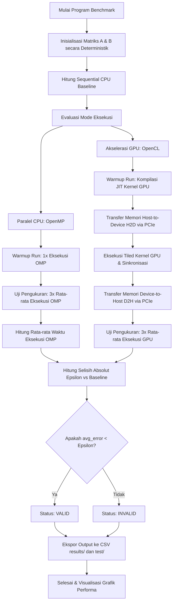

# Laporan Analisis Kinerja Komputasi Heterogeneous GEMM

**Mata Kuliah:** Arsitektur dan Sistem Komputer  
**Program Studi:** S1 Kecerdasan Artifisial (Kelas 2025B)  
**Fakultas Matematika dan Ilmu Pengetahuan Alam**  
**Universitas Negeri Surabaya**  

### Kelompok Penyusun:
* **Raffi Khairan Hidayat** — NIM: `25032014040`
* **Muhammad Panji Asmoro Bangun** — NIM: `25032014088`
* **Ridho Aryo Ramadhan** — NIM: `25032014069`  

  

---

## 1. Pendahuluan

Operasi perkalian matriks (GEMM - General Matrix Multiplication) merupakan salah satu operasi dasar yang paling penting dalam beban kerja komputasi ilmiah dan kecerdasan artifisial (deep learning). Laporan ini menyajikan analisis komparatif performa komputasi perkalian matriks menggunakan tiga arsitektur yang berbeda:
* **Sequential CPU (Baseline):** Eksekusi single-thread pada CPU untuk menguji fungsionalitas dan mendapatkan akurasi numerik dasar.
* **Parallel CPU (OpenMP):** Pemanfaatan arsitektur multi-core CPU dengan membagi beban kerja secara paralel menggunakan pragma compiler.
* **GPU Acceleration (OpenCL):** Eksploitasi throughput paralel GPU berskala besar dengan memori lokal teroptimasi (tiling).

---

## 2. Spesifikasi Sistem Pengujian

Benchmark dijalankan pada sistem dengan arsitektur hardware sebagai berikut:
* **Processor (CPU):** Intel Core i5-14450HX (Arsitektur Hybrid dengan Performance Cores dan Efficiency Cores, Hyper-Threading aktif).
* **Graphics Processor (GPU):** NVIDIA GeForce RTX 4050 Laptop GPU (Arsitektur Ada Lovelace, memiliki CUDA Cores pendukung FMA throughput tinggi, VRAM 6GB).
* **Interconnect:** PCIe Bus (CPU ↔ GPU) yang berpotensi menjadi bottleneck transfer memori.
* **Operating System & Compiler:** Arch Linux dengan compiler GCC (dukungan OpenMP terintegrasi) dan NVIDIA OpenCL SDK runtime.

---

## 3. Metodologi Pengujian dan Validasi

### Metodologi Benchmark
* Matriks bertipe `float` (presisi tunggal) berukuran kuadrat $N \times N$, dengan $N \in \{256, 512, 1024, 2048\}$.
* Setiap pengujian didahului oleh **1x warmup run** (tidak masuk dalam perhitungan waktu eksekusi) untuk mengeleminasi waktu inisialisasi driver dan kompilasi runtime OpenCL kernel.
* Waktu eksekusi dihitung berdasarkan rata-rata dari **3x measurement runs**.
* Hasil akhir diekspor secara otomatis ke dalam file CSV dengan format `mode,size,time,valid`.

### Protokol Validasi Epsilon
Operasi floating-point pada komputer tidak bersifat asosiatif karena pembulatan representasi IEEE 754:
$$(A + B) + C \neq A + (B + C)$$
Selain itu, GPU NVIDIA menggunakan instruksi **FMA (Fused Multiply-Add)** yang menyatukan operasi perkalian dan pertambahan dengan satu kali pembulatan, sementara CPU melakukan dua kali pembulatan. Oleh karena itu, hasil numerik antara CPU dan GPU tidak akan identik secara absolut.

Validasi dilakukan dengan menghitung rata-rata akumulasi error absolut per elemen matriks:
$$\text{avg\_error} = \frac{1}{N^2} \sum_{i=0}^{N-1} \sum_{j=0}^{N-1} |P[i][j] - S[i][j]|$$
Di mana $P$ adalah matriks hasil paralel (OpenMP atau OpenCL) dan $S$ adalah hasil sequential baseline. Hasil dinyatakan **VALID** jika $\text{avg\_error} < 10^{-4}$ ($\epsilon = 1e-4$).

### 3.1 Diagram Alur Sistem (Flowchart)

Berikut adalah diagram alur jalannya eksekusi program benchmark dan validasi pada sistem heterogeneous:

---

## 4. Hasil dan Analisis Kinerja

Data hasil pengujian yang terekam adalah sebagai berikut:

| Mode | N = 256 | N = 512 | N = 1024 | N = 2048 |
| :--- | :---: | :---: | :---: | :---: |
| **Sequential (CPU)** | 0.0086s | 0.0654s | 2.4354s | 22.5848s |
| **OpenMP (6 Threads)** | 0.0030s | 0.0132s | 0.4045s | 3.1620s |
| **OpenCL (GPU)** | 0.0948s | 0.0870s | 0.1024s | 0.1547s |

### Analisis CPU (OpenMP)
* **Karakteristik Penjadwalan:** Menggunakan pragma `#pragma omp parallel for collapse(2) schedule(static)` untuk mendistribusikan beban kerja secara seimbang pada thread pool.
* **Analisis Performa:** Memberikan peningkatan kinerja yang stabil dengan speedup sekitar $2.8\times$ hingga $7.1\times$.
* **Bottleneck:** Terjadi bottleneck berupa *thread contention* dan kompetisi penggunaan L2/L3 cache yang digunakan bersama oleh core hybrid CPU. Untuk alasan ini, jumlah thread diatur ke **6 thread** (sesuai jumlah Performance Cores fisik) guna menghindari degradasi performa akibat dialokasikannya thread ke Efficiency Cores yang lebih lambat atau akibat Hyper-Threading oversubscription.

### Analisis GPU (OpenCL)
* **Optimasi Kernel (Tiling):** Kernel dirancang dengan teknik *tiling* menggunakan memori lokal (scratchpad memory) berukuran $16 \times 16$. Setiap work-item memuat sepotong matriks ke memori lokal secara kolektif, mengurangi akses berulang ke memori global GPU (VRAM) yang berlatensi tinggi.
* **Dampak Ukuran Matriks:**
  * **Ukuran Kecil ($N \le 512$):** OpenCL memberikan performa yang jauh lebih lambat dibanding sequential CPU (speedup $< 1\times$). Hal ini disebabkan oleh overhead inisialisasi pipeline OpenCL, latensi peluncuran kernel (*kernel launch latency*), dan transfer data melalui bus PCIe (Host-to-Device dan Device-to-Host) yang mendominasi seluruh waktu eksekusi.
  * **Ukuran Besar ($N \ge 1024$):** Akses komputasi masif GPU mulai terjustifikasi. Pada ukuran $N = 2048$, GPU mencapai speedup **146.0×** dibanding sequential CPU. throughput komputasi GPU yang masif dikombinasikan dengan pemanfaatan local memory coalescing dan FMA menutupi overhead PCIe transfer secara penuh.

---

## 5. Kesimpulan Akademik

1. **Crossover Point Performa:** Keunggulan akselerasi GPU (OpenCL) baru terlihat ketika ukuran problem ($N$) cukup besar untuk menyembunyikan overhead transfer PCIe. Pada matriks kecil, penjadwalan multi-core CPU (OpenMP) adalah pilihan terbaik karena overhead transfer interkoneksi bernilai nol.
2. **Kesesuaian Validasi:** Perbedaan hasil numerik bernilai sangat kecil dan berhasil divalidasi menggunakan ambang batas epsilon ($\epsilon = 1e-4$), mengonfirmasi kebenaran komputasi di seluruh implementasi paralel.

### Kalimat Penutup Sidang Proyek:
> *"Perbedaan hasil numerik kecil bukan merupakan kesalahan, melainkan konsekuensi dari implementasi floating-point yang berbeda antara CPU dan GPU, khususnya penggunaan FMA pada GPU. Oleh karena itu, validasi dilakukan menggunakan epsilon threshold, bukan exact equality."*
