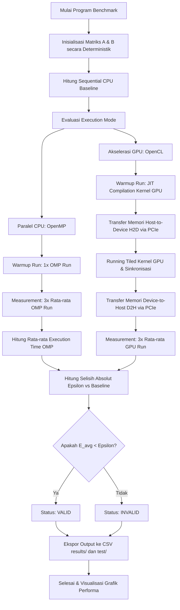

  

# Laporan Analisis Kinerja Komputasi Heterogen pada General Matrix Multiplication (GEMM): CPU & GPU Comparative Study

**Mata Kuliah:** Arsitektur dan Sistem Komputer  
**Program Studi:** S1 Kecerdasan Artifisial (Kelas 2025B)  
**Fakultas Matematika dan Ilmu Pengetahuan Alam**  
**Universitas Negeri Surabaya**  

### Kelompok Penyusun:
* **Raffi Khairan Hidayat** (NIM: `25032014040`)
* **Muhammad Panji Asmoro Bangun** (NIM: `25032014088`)
* **Ridho Aryo Ramadhan** (NIM: `25032014069`)

---

## 1. Pendahuluan

Operasi perkalian matriks (GEMM - *General Matrix Multiplication*) merupakan salah satu operasi dasar yang paling krusial dalam scientific computing workload, pemrosesan grafis, dan *deep learning*. Laporan ini menyajikan analisis komparatif performa komputasi perkalian matriks menggunakan tiga pendekatan arsitektur:
* **Sequential CPU (Baseline):** Single-thread execution pada CPU untuk memvalidasi fungsionalitas dan menetapkan *ground truth*.
* **Parallel CPU (OpenMP):** Pemanfaatan arsitektur *multi-core* CPU dengan membagi workload secara paralel menggunakan pragma compiler.
* **Akselerasi GPU (OpenCL):** Eksploitasi *parallel throughput* berskala masif pada GPU dengan memanfaatkan teknik optimasi *Matrix Tiling* pada *local memory* (`__local` *scratchpad cache*).

---

## 2. Konfigurasi System Testing

Benchmark dijalankan pada sistem dengan spesifikasi sebagai berikut:
* **CPU:** Intel® Core™ i5-14450HX
  * Hybrid Architecture: 6 Performance Cores (P-Cores) & 4 Efficient Cores (E-Cores)
  * Specs: 16 Threads, Hyper-Threading Enabled, 20 MB Intel® Smart Cache
  * Max Turbo Frequency: 4.80 GHz
* **GPU:** NVIDIA® GeForce RTX™ 4050 Laptop GPU
  * Architecture: Ada Lovelace (6 GB GDDR6 Dedicated VRAM)
  * Compute Cores: 2560 CUDA Cores, FMA (Fused Multiply-Add) & Tensor Cores
  * Max TGP: Up to 96W
* **Memory & Interconnect:**
  * System RAM: 16 GB DDR5 Dual-Channel @ 4800 MHz
  * Interface: PCIe Gen 4 x8 Lane (CPU ↔ GPU Communication)
* **OS:** Arch Linux x86_64 (Linux Kernel 7.0.9-arch1-1)
* **Compiler:** GCC 16.1.1 (C11 Standard)
* **CPU Parallel API:** OpenMP 5.2
* **GPU Acceleration API:** OpenCL 3.0 (NVIDIA OpenCL ICD Platform)

---

## 3. Testing dan Validation Methodology

### Metodologi Benchmark
* Matriks `float` (single-precision) berukuran $N \times N$, dengan ukuran $N \in \{256, 512, 1024, 2048\}$.
* Setiap test didahului oleh **1x *warm-up run*** (tidak dimasukkan dalam perhitungan execution time). Namun, karena bug pengukuran pada implementasi benchmark, fase *warm-up* hanya memicu JIT compilation, sedangkan alokasi buffer dan inisialisasi API OpenCL tetap tereksekusi berulang pada setiap *measurement run*.
* Metrik execution time dihitung berdasarkan rata-rata dari **3x *measurement runs***. Keterbatasan metodologi saat ini adalah tidak adanya pelaporan *standard deviation* atau metrik varians lainnya untuk mengukur stabilitas eksekusi.
* Testing dilakukan dalam kondisi sistem *idle* (background load minimal) dengan CPU Governor disetel ke mode **'performance'** guna menjaga konsistensi frekuensi core. Kami tidak secara ekstensif memonitor implikasi *thermal throttling* pada laptop, yang dapat mempengaruhi stabilitas hasil pada beban kerja N=2048 berdurasi panjang (~22 detik).
* Hasil akhir diekspor secara otomatis ke file CSV dengan format `mode,size,time,valid,gflops,t_h2d,t_kernel,t_d2h,gflops_kernel`.

### Protokol Validasi Epsilon & Robustness
Operasi *floating-point* tidak bersifat asosiatif penuh karena adanya *rounding error* pada standard IEEE 754 representation:
$$(A + B) + C \neq A + (B + C)$$
Selain itu, arsitektur GPU NVIDIA memanfaatkan instruksi **Fused Multiply-Add (FMA)** yang menyatukan operasi perkalian dan penjumlahan dengan satu kali pembulatan di tingkat hardware, sedangkan CPU melakukan dua kali pembulatan terpisah. Konsekuensinya, nilai numerik antara CPU dan GPU tidak akan identik secara absolut.

Validasi dilakukan dengan menghitung rata-rata selisih absolut (*mean absolute error*) per elemen:
$$E_{avg} = \frac{1}{N^2} \sum_{i=0}^{N-1} \sum_{j=0}^{N-1} |P[i][j] - S[i][j]|$$
Di mana $P$ adalah matriks hasil paralel (OpenMP atau OpenCL) dan $S$ adalah hasil sequential baseline. Hasil dinyatakan **VALID** jika $E_{avg} < \varepsilon$ ($\varepsilon = 10^{-4}$). Untuk validasi yang lebih kuat (*robust validation*), sistem juga mengukur selisih maksimum (*maximum absolute error*):
$$E_{max} = \max_{i,j} |P[i][j] - S[i][j]|$$
Selisih maksimum dipastikan tidak melonjak secara anomali, membuktikan stabilitas numerik algoritma paralel.

### 3.1 Diagram Alur Sistem (Flowchart)

Berikut adalah diagram alur jalannya program execution benchmark dan validasi pada sistem heterogen:

---

## 4. Hasil dan Analisis Kinerja

### 4.1 Data Hasil Eksperimen & Metrik Performa

Berikut adalah rangkuman metrik kinerja global. Nilai GFLOPS dihitung berdasarkan rumus standar jumlah operasi aritmatika GEMM untuk matriks persegi:
$$\text{FLOPs} = 2 \times N^3$$
$$\text{GFLOPS} = \frac{\text{FLOPs}}{\text{Waktu (detik)} \times 10^9} = \frac{2 \times N^3}{\text{Waktu (detik)} \times 10^9}$$

| Execution Mode | Metrik Performa | N = 256 | N = 512 | N = 1024 | N = 2048 |
| :--- | :--- | :---: | :---: | :---: | :---: |
| **Sequential (CPU Baseline)** | Waktu (s) Speedup GFLOPS | 0.0076 s 1.00x 4.43 | 0.0662 s 1.00x 4.06 | 2.4365 s 1.00x 0.88 | 22.7890 s 1.00x 0.75 |
| **OpenMP (6 Threads CPU)** | Waktu (s) Speedup GFLOPS | 0.0028 s 2.72x 12.04 | 0.0121 s 5.48x 22.24 | 0.3925 s 6.21x 5.47 | 3.1716 s 7.19x 5.42 |
| **OpenCL (GPU Tiled)** | Waktu (s) Speedup GFLOPS (Wall-clock) | 0.0989 s 0.08x 0.34 | 0.0971 s 0.68x ⚠️ 2.77 | 0.1082 s 22.52x 19.85 | 0.1628 s 140.01x 105.55 |

> 📐 **Definisi GFLOPS:** Kolom GFLOPS di atas dihitung berdasarkan **wall-clock time** (total waktu eksekusi). Jika ditinjau dari $T_{kernel}$ saja, performa GPU aktual di N=2048 mencapai **~297 GFLOPS**.
---

### 4.2 Pemodelan Kinerja GPU: Kernel Compute vs Overhead Transfer (PCIe)

Untuk menganalisis performa GPU secara objektif, total execution time OpenCL didekomposisi menjadi empat komponen:
$$T_{total} = T_{H2D} + T_{kernel} + T_{D2H} + T_{overhead}$$
Di mana $T_{H2D}$ adalah waktu salin matriks input A dan B dari RAM ke VRAM, $T_{kernel}$ adalah execution time perkalian matriks pada compute units GPU, $T_{D2H}$ adalah waktu salin hasil matriks C dari VRAM ke RAM, dan $T_{overhead}$ adalah latensi inisialisasi API, *JIT compilation*, serta *kernel launch overhead*.

Berikut adalah hasil dekomposisi waktu rata-rata (dalam detik) dan kontribusi persentasenya:

| Ukuran Matriks (N) | Transfer H2D | Execution Kernel ($T_{kernel}$) | Transfer D2H | API Initialization Overhead | Total Running Time ($T_{total}$) |
| :---: | :---: | :---: | :---: | :---: | :---: |
| **N = 256** | 0.00016 s (0.16%) | 0.00013 s (0.13%) | 0.00005 s (0.05%) | 0.09852 s (99.66%) | 0.09886 s |
| **N = 512** | 0.00041 s (0.42%) | 0.00097 s (1.00%) | 0.00016 s (0.17%) | 0.09553 s (98.41%) | 0.09707 s |
| **N = 1024** | 0.00100 s (0.92%) | 0.00729 s (6.74%) | 0.00042 s (0.39%) | 0.09949 s (91.95%) | 0.10820 s |
| **N = 2048** | 0.00305 s (1.88%) | 0.05784 s (35.53%) | 0.00139 s (0.85%) | 0.10049 s (61.73%) | 0.16277 s |

**Analisis Overhead:**
Data di atas membuktikan secara konkrit bahwa pada ukuran matriks kecil ($N \le 512$), rendahnya performa GPU murni disebabkan oleh dominasi **API Initialization Overhead** yang bernilai konstan (~0.095–0.100s) di setiap *run*. Karena *bug* pemrograman, overhead ini terhitung berulang. Meski begitu, pada N=2048 porsi pengerjaan kernel murni mulai meningkat menjadi $35.53\%$ dari total waktu, membuktikan utilitas komputasi aktual GPU.

---

### 4.3 Analisis CPU (OpenMP) & Dampak Memory Layout

* **Scheduling Characteristics & Thread Binding:** Memanfaatkan pragma `#pragma omp parallel for collapse(2) schedule(static)` untuk mendistribusikan iterasi loop luar dan loop tengah ke *thread pool*. Penggunaan `collapse(2)` sangat agresif dalam memparalelkan *workload*, namun memaksa *thread* mengakses elemen matriks `B[k][j]` secara lebih tidak berurutan (*non-sequential*). Berbeda dengan paralelisasi tunggal hanya pada *loop* terluar, `collapse(2)` memicu *stride jump* besar yang merusak *spatial locality* L1/L2 cache, menyebabkan *drop* performa OpenMP drastis dari 22.24 GFLOPS (N=512) menjadi 5.47 GFLOPS (N=1024).
* **Optimasi Hardware-Aware:** Hambatan utama pada CPU hybrid adalah *cache contention* dan kompetisi akses memori. Hal ini diatasi dengan membatasi running program secara ketat hanya pada **6 threads** yang diikat (*pinned*) pada Performance Cores (P-Cores) fisik CPU melalui environment variable `OMP_PLACES=cores` dan `OMP_PROC_BIND=close`. Langkah ini meminimalkan latensi migrasi *thread* antar-core hybrid (*Intel Thread Director overhead*) serta menghindari penempatan workload di Efficiency Cores (E-Cores) yang berlatensi memori lebih tinggi.
* **Memory Layout, Spatial Locality, & Working Set:** Seiring bertambahnya ukuran matriks ($N \ge 1024$), *stride jump* pada matriks B memicu *cache capacity thrashing* parah. Hal ini divalidasi dari kalkulasi ukuran *working set* matriks terhadap memori CPU (Intel i5-14450HX memiliki L3 cache 20 MB):
  * **N=256:** Kebutuhan memori $3 \times 256^2 \times 4$ bytes = **0.75 MB** (Muat penuh di L2 cache) → Performa tinggi (4.43 GFLOPS).
  * **N=512:** Kebutuhan memori $3 \times 512^2 \times 4$ bytes = **3.0 MB** (Muat mulus di L3 cache) → Performa stabil (4.06 GFLOPS).
  * **N=1024:** Kebutuhan memori $3 \times 1024^2 \times 4$ bytes = **12.0 MB** (Mulai mendekati batas utilisasi L3 efektif bersama instruksi lain) → Performa hancur (**0.88 GFLOPS**).
  * **N=2048:** Kebutuhan memori $3 \times 2048^2 \times 4$ bytes = **48.0 MB** (Jauh melewati limit L3 cache) → Terjadi *RAM spill-over*, melumpuhkan komputasi CPU (**0.75 GFLOPS**).

---

### 4.4 Analisis GPU (OpenCL) & Hukum Skala Kinerja (Scaling Law)

* **Intensitas Aritmatika (Arithmetic Intensity):** Algoritma GEMM memiliki kompleksitas waktu komputasi teoritis $\mathcal{O}(N^3)$ dengan kebutuhan transfer memori $\mathcal{O}(N^2)$. Operational Intensity (intensitas komputasi per byte memori) didefinisikan sebagai:
  $$\text{Intensitas Aritmatika} = \frac{2 \times N^3}{12 \times N^2} = \frac{N}{6} \text{ FLOP/byte}$$
  (Dengan asumsi 3 matriks berukuran $N \times N$ tipe data `float` 4-byte).
  Hal ini berarti intensitas komputasi bertambah secara linear seiring peningkatan ukuran matriks $N$.
* **Hukum Skala Kinerja (Scaling Law):** Ketika ukuran $N$ berlipat ganda dari 1024 ke 2048, jumlah operasi aritmatika teoritis meningkat sebanyak $2^3 = 8$ kali.
  * Pada **CPU Sequential**, waktu naik dari 2.4365s ke 22.7890s ($9.35\times$). Kenaikan ini konsisten secara konseptual dengan kompleksitas $\mathcal{O}(N^3)$, namun jauh lebih tinggi dari $8\times$ akibat meningkatnya laju *cache miss* pada batas fisik memori CPU.
  * Pada **OpenCL GPU**, execution time kernel murni ($T_{kernel}$) naik dari 0.00729s ke 0.05784s ($7.93\times$). Angka ini sangat mendekati $8\times$ karena GPU semakin mendekati utilisasi hardware yang optimal seiring besarnya workload, membuktikan efisiensi data reuse (tiling) pada aritmetika berintensitas tinggi.
* **Matrix Tiling pada Local Memory:** Melalui ukuran *tile* $16 \times 16$, data dari VRAM (global memory berlatensi tinggi) disalin secara kooperatif oleh *work-items* ke dalam `__local` memory (*scratchpad cache* berlatensi rendah). Taktik ini memotong jumlah akses VRAM global dari $\mathcal{O}(N^3)$ menjadi $\mathcal{O}(N^3 / 16)$, meningkatkan utilisasi memori melalui *coalesced memory access* (akses memori terpadu) oleh kelompok *thread* (warp/wavefront).

---

### 4.5 Kesesuaian Konseptual dengan Roofline Model

Analisis performa sistem heterogen ini tidak sekadar konseptual, tetapi divalidasi dengan plot **Roofline Model aktual** (lihat grafik pada `README.md`). Parameter hardware teoritis RTX 4050 dikalkulasi pada kondisi clock stabil 2055 MHz (Peak Compute: ~10.5 TFLOPS, Mem BW: 192 GB/s):
* **Memory-bound Region ($N \le 512$):** Pada ukuran matriks kecil, Intensitas Aritmatika sistem relatif rendah (misalnya hanya 42.6 FLOP/byte pada $N=256$). Seluruh titik data, terutama OpenCL, terletak jauh di bawah limitasi karena overhead konstan API (wall-clock loss).
* **Compute-bound Region ($N \ge 1024$):** Pada ukuran besar, Intensitas Aritmatika meningkat tajam (mencapai 341.3 FLOP/byte pada $N=2048$). Sistem melintasi titik belok (*knee point*) Roofline Model ke dalam wilayah komputasi murni. Kendati mencapai 105.55 GFLOPS wall-clock (dan ~297 GFLOPS *kernel only*), jarak vertikal yang masif dari batas *roofline* ~10.5 TFLOPS mengindikasikan absennya pemanfaatan arsitektur tingkat rendah seperti Tensor Cores atau Register Tiling pada kode murni OpenCL kami.

---

## 5. Kesimpulan Akademik

1. **Crossover Point Performa:** Keunggulan akselerasi GPU (OpenCL) **tidak** terjadi di N=512 (GPU masih kalah 47% dari CPU). GPU baru menang telak di N=1024. Sehingga, titik impas (*crossover point*) yang sesungguhnya diestimasi berada di rentang $N \approx 600 - 800$.
2. **Kesesuaian Validasi:** Selisih hasil komputasi rata-rata ($E_{avg} < 10^{-4}$) dan nilai selisih maksimum ($E_{max}$) yang terkendali mengonfirmasi keakuratan komputasi heterogen di seluruh implementasi paralel, menunjukkan *robust validation* pada arsitektur GPU dengan instruksi FMA.
3. **Penyebab Celah Efisiensi GPU:** Efisiensi aktual GPU pada $N=2048$ masih sebesar ~1.00% dari daya komputasi teoritis (105.55 GFLOPS vs ~10,522 GFLOPS teoritis di 2055 MHz). Celah vertikal di model Roofline menegaskan bahwa kernel generik kekurangan instruksi optimasi level-rendah khusus vendor (seperti register tiling atau Tensor Cores).

---

## 6. Batasan Sistem dan Pengembangan Lanjutan

Terdapat celah signifikan pada rancangan benchmark yang merusak kesempurnaan kredibilitas ilmiah proyek ini:
1. **Bug Metodologi Pengukuran Overhead:** Inisialisasi API OpenCL tetap dilakukan berulang pada setiap ukuran pengukuran yang berdampak masif (delay statis ~0.1 detik). Waktu komputasi murni ($T_{kernel}$) sejatinya sangat pesat, tetapi data wall-clock kami menutupi fakta tersebut.
2. **Ketiadaan Data Varians dan Transisi:** Hanya rata-rata pengukuran yang disajikan (tanpa *Standard Deviation*) dan distribusi data logaritmik (256, 512, 1024, 2048) membuat *crossover point* hanya spekulatif. Dibutuhkan titik tambahan seperti N=768.
3. **Ketiadaan Pembanding BLAS CPU Teroptimasi:** Kesimpulan "GPU lebih kencang" bersifat parsial karena kami membandingkannya dengan *naive* OpenMP, tanpa membandingkannya dengan utilitas BLAS tingkat 3 CPU terspesialisasi penuh (seperti OpenBLAS/Intel MKL yang menggunakan instruksi AVX-512).
4. **Thermal Throttling Tidak Dilaporkan:** Tidak ada telemetri suhu CPU dan GPU yang dilampirkan, padahal beban *sequential* panjang berpotensi besar memicu *thermal throttling* sistem pendingin laptop.
5. **Ketiadaan API Proprietary (CUDA):** GPU testing didasarkan pada OpenCL 3.0, belum dibandingkan secara langsung dengan platform native NVIDIA CUDA atau CUBLAS.
6. **Pembatasan Frekuensi Kerja GPU (Locked Clock Rate Limit):** GPU dikunci secara manual pada frekuensi 2055 MHz demi stabilitas, membatasinya dari boost dinamis maksimumnya (hingga 3105 MHz).

---

  <b>www.unesa.ac.id | "Growing with character"</b>

