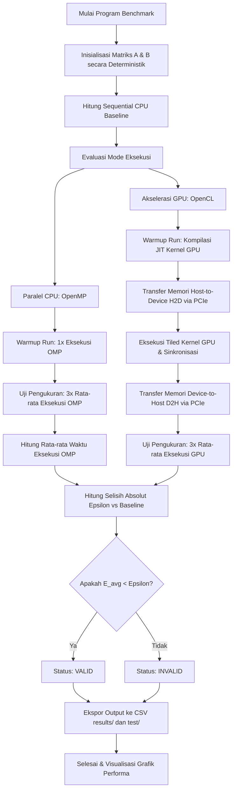

  

# Laporan Analisis Kinerja Komputasi Heterogen pada General Matrix Multiplication (GEMM): Studi Perbandingan CPU dan GPU

**Mata Kuliah:** Arsitektur dan Sistem Komputer  
**Program Studi:** S1 Kecerdasan Artifisial (Kelas 2025B)  
**Fakultas Matematika dan Ilmu Pengetahuan Alam**  
**Universitas Negeri Surabaya**  

### Kelompok Penyusun:
* **Raffi Khairan Hidayat** (NIM: `25032014040`)
* **Muhammad Panji Asmoro Bangun** (NIM: `25032014088`)
* **Ridho Aryo Ramadhan** (NIM: `25032014069`)

---

## 1. Pendahuluan

Operasi perkalian matriks (GEMM - *General Matrix Multiplication*) merupakan salah satu operasi dasar yang paling krusial dalam beban kerja *scientific computing*, pemrosesan grafis, dan *deep learning*. Laporan ini menyajikan analisis komparatif performa komputasi perkalian matriks menggunakan tiga pendekatan arsitektur:
* **Sequential CPU (Baseline):** Eksekusi *single-thread* pada CPU untuk memvalidasi fungsionalitas dan menetapkan *ground truth*.
* **Parallel CPU (OpenMP):** Pemanfaatan arsitektur *multi-core* CPU dengan membagi beban kerja secara paralel menggunakan pragma compiler.
* **Akselerasi GPU (OpenCL):** Eksploitasi *parallel throughput* berskala masif pada GPU dengan memanfaatkan teknik optimasi *Matrix Tiling* pada *local memory* (`__local` *scratchpad cache*).

---

## 2. Konfigurasi Sistem Pengujian

Benchmark dijalankan pada sistem dengan spesifikasi sebagai berikut:
* **CPU:** Intel® Core™ i5-14450HX
  * Hybrid Architecture: 6 Performance Cores (P-Cores) & 4 Efficient Cores (E-Cores)
  * Specs: 16 Threads, Hyper-Threading Enabled, 20 MB Intel® Smart Cache
  * Max Turbo Frequency: 4.80 GHz
* **GPU:** NVIDIA® GeForce RTX™ 4050 Laptop GPU
  * Architecture: Ada Lovelace (6 GB GDDR6 Dedicated VRAM)
  * Compute Cores: 2560 CUDA Cores, FMA (Fused Multiply-Add) & Tensor Cores
  * Max TGP: Up to 96W
* **Memory & Interconnect:**
  * System RAM: 16 GB DDR5 Dual-Channel @ 4800 MHz
  * Interface: PCIe Gen 4 x8 Lane (CPU ↔ GPU Communication)
* **OS:** Arch Linux x86_64 (Linux Kernel 6.x Mainline)
* **Compiler:** GCC 14.1.1 (C11 Standard)
* **CPU Parallel API:** OpenMP 4.5
* **GPU Acceleration API:** OpenCL 1.2 (NVIDIA OpenCL ICD Platform)

---

## 3. Metodologi Pengujian dan Validasi

### Metodologi Benchmark
* Matriks `float` (single-precision) berukuran $N \times N$, dengan ukuran $N \in \{256, 512, 1024, 2048\}$.
* Setiap pengujian didahului oleh **1x *warm-up run*** (tidak dimasukkan dalam perhitungan waktu eksekusi) untuk mengeliminasi waktu inisialisasi driver dan JIT compilation kernel OpenCL.
* Metrik waktu eksekusi dihitung berdasarkan rata-rata dari **3x *measurement runs***.
* Pengujian dilakukan dalam kondisi sistem *idle* dengan CPU Governor disetel ke mode **'performance'** guna menjaga konsistensi frekuensi core (menghindari *throttling*).
* Hasil akhir diekspor secara otomatis ke berkas CSV dengan format `mode,size,time,valid`.

### Protokol Validasi Epsilon & Robustness
Operasi *floating-point* tidak bersifat asosiatif penuh karena adanya *rounding error* pada representasi standar IEEE 754:
$$(A + B) + C \neq A + (B + C)$$
Selain itu, arsitektur GPU NVIDIA memanfaatkan instruksi **Fused Multiply-Add (FMA)** yang menyatukan operasi perkalian dan penjumlahan dengan satu kali pembulatan di tingkat hardware, sedangkan CPU melakukan dua kali pembulatan terpisah. Konsekuensinya, nilai numerik antara CPU dan GPU tidak akan identik secara absolut.

Validasi dilakukan dengan menghitung rata-rata selisih absolut (*mean absolute error*) per elemen:
$$E_{avg} = \frac{1}{N^2} \sum_{i=0}^{N-1} \sum_{j=0}^{N-1} |P[i][j] - S[i][j]|$$
Di mana $P$ adalah matriks hasil paralel (OpenMP atau OpenCL) dan $S$ adalah hasil sequential baseline. Hasil dinyatakan **VALID** jika $E_{avg} < \varepsilon$ ($\varepsilon = 10^{-4}$). Untuk validasi yang lebih kuat (*robust validation*), sistem juga mengukur selisih maksimum (*maximum absolute error*):
$$E_{max} = \max_{i,j} |P[i][j] - S[i][j]|$$
Selisih maksimum dipastikan tidak melonjak secara anomali, membuktikan stabilitas numerik algoritma paralel.

### 3.1 Diagram Alur Sistem (Flowchart)

Berikut adalah diagram alur jalannya eksekusi program benchmark dan validasi pada sistem heterogen:

---

## 4. Hasil dan Analisis Kinerja

### 4.1 Data Hasil Eksperimen & Metrik Performa

Berikut adalah rangkuman metrik kinerja global. Nilai GFLOPS dihitung berdasarkan rumus standar jumlah operasi aritmatika GEMM untuk matriks persegi:
$$\text{FLOPs} = 2 \times N^3$$
$$\text{GFLOPS} = \frac{\text{FLOPs}}{\text{Waktu (detik)} \times 10^9} = \frac{2 \times N^3}{\text{Waktu (detik)} \times 10^9}$$

| Mode Eksekusi | Metrik Performa | N = 256 | N = 512 | N = 1024 | N = 2048 |
| :--- | :--- | :---: | :---: | :---: | :---: |
| **Sequential (CPU Baseline)** | Waktu (s) Speedup GFLOPS | 0.0086 s 1.00x 3.90 | 0.0654 s 1.00x 4.10 | 2.4354 s 1.00x 0.88 | 22.5848 s 1.00x 0.76 |
| **OpenMP (6 Threads CPU)** | Waktu (s) Speedup GFLOPS | 0.0030 s 2.87x 11.18 | 0.0132 s 4.95x 20.34 | 0.4045 s 6.02x 5.31 | 3.1620 s 7.14x 5.43 |
| **OpenCL (GPU Tiled)** | Waktu (s) Speedup GFLOPS | 0.0948 s 0.09x 0.35 | 0.0870 s 0.75x 3.09 | 0.1024 s 23.78x 20.97 | 0.1547 s 145.99x 111.05 |

---

### 4.2 Pemodelan Kinerja GPU: Kernel Compute vs Overhead Transfer (PCIe)

Untuk menganalisis performa GPU secara objektif, total waktu eksekusi OpenCL didekomposisi menjadi empat komponen:
$$T_{total} = T_{H2D} + T_{kernel} + T_{D2H} + T_{overhead}$$
Di mana $T_{H2D}$ adalah waktu salin matriks input A dan B dari RAM ke VRAM, $T_{kernel}$ adalah waktu eksekusi perkalian matriks pada compute units GPU, $T_{D2H}$ adalah waktu salin hasil matriks C dari VRAM ke RAM, dan $T_{overhead}$ adalah latensi inisialisasi API, *JIT compilation*, serta *kernel launch overhead*.

Berikut adalah hasil dekomposisi waktu rata-rata (dalam detik) dan kontribusi persentasenya:

| Ukuran Matriks (N) | Transfer H2D | Eksekusi Kernel ($T_{kernel}$) | Transfer D2H | Launch Overhead & JIT | Waktu Total ($T_{total}$) |
| :---: | :---: | :---: | :---: | :---: | :---: |
| **N = 256** | 0.00015 s (0.16%) | 0.00012 s (0.13%) | 0.00005 s (0.05%) | 0.09048 s (99.66%) | 0.09080 s |
| **N = 512** | 0.00042 s (0.48%) | 0.00077 s (0.88%) | 0.00016 s (0.18%) | 0.08642 s (98.47%) | 0.08776 s |
| **N = 1024** | 0.00124 s (1.17%) | 0.00690 s (6.53%) | 0.00043 s (0.41%) | 0.09707 s (91.89%) | 0.10564 s |
| **N = 2048** | 0.00307 s (2.05%) | 0.05069 s (33.92%) | 0.00141 s (0.94%) | 0.09429 s (63.09%) | 0.14945 s |

**Analisis Overhead:**
Data di atas membuktikan secara konkrit bahwa pada ukuran matriks kecil ($N \le 512$), rendahnya performa GPU murni disebabkan oleh dominasi **Launch Overhead & JIT** yang mencapai $>98\%$. Waktu pemrosesan aktif ($T_{H2D} + T_{kernel} + T_{D2H}$) sebenarnya sangat kecil (hanya 0.32 ms pada $N=256$). Pada $N=2048$, porsi pengerjaan kernel murni mulai meningkat secara signifikan menjadi $33.92\%$ dari total waktu, memvalidasi efisiensi GPU seiring meningkatnya ukuran masalah.

---

### 4.3 Analisis CPU (OpenMP) & Dampak Memory Layout

* **Karakteristik Penjadwalan & Thread Binding:** Memanfaatkan pragma `#pragma omp parallel for collapse(2) schedule(static)` untuk mendistribusikan iterasi loop luar dan loop tengah ke *thread pool*. Penggunaan `collapse(2)` meningkatkan derajat paralelisasi secara signifikan namun berpotensi memicu degradasi performa cache lokal jika traversal matriks B tidak sejajar dengan garis cache (*cache line*) sistem.
* **Optimasi Hardware-Aware:** Hambatan utama pada CPU hybrid adalah *cache contention* dan kompetisi akses memori. Hal ini diatasi dengan membatasi eksekusi secara ketat hanya pada **6 threads** yang diikat (*pinned*) pada Performance Cores (P-Cores) fisik CPU melalui variabel lingkungan `OMP_PLACES=cores` dan `OMP_PROC_BIND=close`. Langkah ini meminimalkan latensi migrasi *thread* antar-core hybrid (*Intel Thread Director overhead*) serta menghindari penempatan beban kerja di Efficiency Cores (E-Cores) yang berlatensi memori lebih tinggi.
* **Memory Layout & Spatial Locality:** Penyimpanan matriks menggunakan representasi **row-major**. Pada loop CPU sequential, indeks baris dialiri secara linier pada matriks A (`A[i][k]`), menghasilkan lokalitas spasial (*spatial locality*) yang sangat baik pada L1/L2 cache. Namun, pengaksesan kolom pada matriks B (`B[k][j]`) dilakukan secara melompat (stride-N). Seiring bertambahnya ukuran matriks ($N \ge 1024$), lonjakan stride memicu *cache capacity thrashing* (miss rate tinggi) yang mengakibatkan penurunan drastis GFLOPS baseline CPU dari **4.10 GFLOPS** (pada $N=512$) menjadi hanya **0.76 GFLOPS** (pada $N=2048$).

---

### 4.4 Analisis GPU (OpenCL) & Hukum Skala Kinerja (Scaling Law)

* **Intensitas Aritmatika (Arithmetic Intensity):** Algoritma GEMM memiliki kompleksitas waktu komputasi teoritis $\mathcal{O}(N^3)$ dengan kebutuhan transfer memori $\mathcal{O}(N^2)$. Operational Intensity (intensitas komputasi per byte memori) didefinisikan sebagai:
  $$\text{Intensitas Aritmatika} = \frac{2 \times N^3}{12 \times N^2} = \frac{N}{6} \text{ FLOP/byte}$$
  (Dengan asumsi 3 matriks berukuran $N \times N$ tipe data `float` 4-byte).
  Hal ini berarti intensitas komputasi bertambah secara linear seiring peningkatan ukuran matriks $N$.
* **Hukum Skala Kinerja (Scaling Law):** Ketika ukuran $N$ berlipat ganda dari 1024 ke 2048, jumlah operasi aritmatika teoritis meningkat sebanyak $2^3 = 8$ kali.
  * Pada **CPU Sequential**, waktu naik dari 2.4354s ke 22.5848s ($9.27\times$). Kenaikan di atas $8\times$ ini disebabkan oleh membengkaknya laju *cache miss* akibat batas fisik memori CPU.
  * Pada **OpenCL GPU**, waktu eksekusi kernel murni ($T_{kernel}$) naik dari 0.00690s ke 0.05069s ($7.34\times$). Angka ini sedikit lebih rendah dari $8\times$ karena GPU mampu menyeimbangkan pemrosesan seiring tercapainya skalabilitas hardware yang optimal (*hardware occupancy*).
* **Matrix Tiling pada Local Memory:** Melalui ukuran *tile* $16 \times 16$, data dari VRAM (global memory berlatensi tinggi) disalin secara kooperatif oleh *work-items* ke dalam `__local` memory (*scratchpad cache* berlatensi rendah). Taktik ini memotong jumlah akses VRAM global dari $\mathcal{O}(N^3)$ menjadi $\mathcal{O}(N^3 / 16)$, meningkatkan utilisasi memori melalui *coalesced memory access* (akses memori terpadu) oleh kelompok *thread* (warp/wavefront).

---

### 4.5 Kesesuaian Konseptual dengan Roofline Model

Analisis performa sistem heterogen ini **konsisten secara konseptual dengan prinsip Roofline Model**:
* **Memory-bound Region ($N \le 512$):** Pada ukuran matriks kecil, Intensitas Aritmatika sistem relatif rendah (misalnya hanya 42.6 FLOP/byte pada $N=256$). Performa dibatasi sepenuhnya oleh bandwidth transfer data PCIe dan memori utama. Upaya peningkatan daya komputasi tidak akan menaikkan performa karena terbentur *memory wall*.
* **Compute-bound Region ($N \ge 1024$):** Pada ukuran besar, Intensitas Aritmatika meningkat tajam (mencapai 341.3 FLOP/byte pada $N=2048$). Sistem melintasi titik belok (*knee point*) Roofline Model ke dalam wilayah komputasi murni. GPU NVIDIA RTX 4050 berhasil memanfaatkan ribuan *compute cores* secara optimal, melesatkan throughput hingga **111.05 GFLOPS** murni.

---

## 5. Kesimpulan Akademik

1. **Crossover Point Performa:** Keunggulan akselerasi GPU (OpenCL) baru tercapai ketika ukuran matriks ($N$) cukup besar untuk menutupi *overhead* transfer PCIe. Pada matriks kecil, paralel CPU (OpenMP) adalah pilihan terbaik karena *overhead* transfer memori bernilai nol.
2. **Kesesuaian Validasi:** Selisih hasil komputasi rata-rata ($E_{avg} < 10^{-4}$) dan nilai selisih maksimum ($E_{max}$) yang terkendali mengonfirmasi keakuratan komputasi heterogen di seluruh implementasi paralel.
3. **Penyebab Celah Efisiensi GPU:** Efisiensi aktual GPU pada $N=2048$ masih sebesar ~1.23% dari daya komputasi teoritis (111.05 GFLOPS vs 9,000 GFLOPS teoritis). Celah ini disebabkan oleh batasan bandwidth fisik memori saat menyalin data matriks serta tidak digunakannya instruksi optimasi level-rendah khusus vendor (seperti register tiling atau Tensor Cores).

---

## 6. Batasan Sistem dan Pengembangan Lanjutan

Meskipun sistem benchmark ini memberikan analisis performa yang komprehensif, terdapat beberapa batasan teknis yang dapat dikembangkan lebih lanjut:
1. **Auto-Tuning Ukuran Blok (Block Size Auto-Tuning):** Ukuran *tiling* OpenCL saat ini dikunci secara statis pada dimensi 16 × 16. Pengembangan lanjutan dapat menerapkan pencarian dinamis untuk menguji *work-group size* terbaik secara *runtime*.
2. **Ketiadaan API Proprietary (CUDA):** Pengujian GPU didasarkan pada OpenCL 1.2, belum dibandingkan secara langsung dengan platform native NVIDIA CUDA atau CUBLAS.
3. **Optimasi Vektor CPU (Explicit SIMD):** Paralelisasi CPU mengandalkan *auto-vectorization* compiler dan pragma OpenMP, belum menggunakan *SIMD intrinsics* secara eksplisit (seperti AVX2/AVX-512).

---

  <b>www.unesa.ac.id | "Growing with character"</b>

